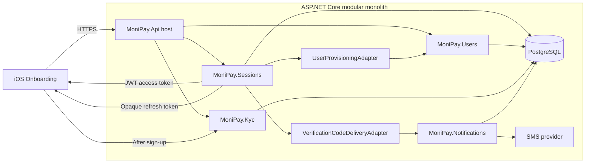
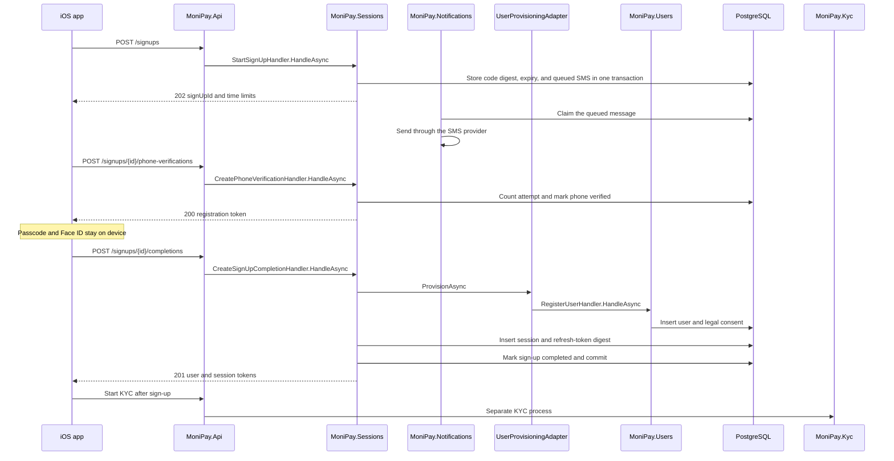

# Sign-up backend architecture

Status: Proposed

## Purpose

This design maps the existing MoniPay sign-up flow to the .NET modular monolith.

The design covers phone verification, user creation, and the first authenticated session. KYC starts after sign-up and stays in `MoniPay.Kyc`.

## Decision

Sign-up spans two planned bounded contexts:

- `MoniPay.Sessions` owns phone verification, sign-up state, access tokens, refresh tokens, and session revocation.
- `MoniPay.Users` owns the user profile, normalized contact data, locale, and legal-consent records.

`MoniPay.Api` composes the two modules through one adapter. Neither module references the other module project.

The four-digit passcode and Face ID remain on the device. The backend never receives the passcode or biometric data.

The design has no customer roles. Customer access uses claims and named authorization policies. Internal administration is outside this design.

## Observed flow

The prototype and the iOS app use this order:

| Step | Observed behavior | Backend responsibility |
|---|---|---|
| Welcome | The user starts sign-up. | None. |
| Phone | The user enters a country code and phone number. | Start a sign-up and send a verification code. |
| Code | The user enters six digits and can request another code. | Verify the code, enforce expiry, and enforce attempt limits. |
| Passcode | The user creates and confirms four digits. | None. Keep this secret on the device. |
| Biometrics | The user enables Face ID or selects Later. | None. Keep biometric enrollment on the device. |
| Profile | The user enters first name, last name, and email. | Create the user and the first session in one transaction. |
| KYC | The user starts KYC or selects Later. | Hand control to `MoniPay.Kyc`. Do not add KYC state to sign-up. |

The browser-driven prototype check confirmed the complete path. It reached the identity-approved screen after phone, code, passcode, biometrics, profile, document, and selfie steps.

## Current gaps

The current prototype and iOS implementation do not provide production authentication:

- `prototype/app.js` accepts every six-digit verification code.
- `prototype/app.js` stores the profile in `localStorage`.
- `prototype/app.js` sends one `POST /signup` request after the profile step.
- `poc/server.js` creates an in-memory user and a card-provider customer.
- `ios/Packages/Onboarding/Sources/Onboarding/Models/SignUpModel.swift` simulates code verification.
- The iOS passcode exists only for the sign-up flow.
- The iOS app drops the returned user identifier and stores no session.
- The .NET server has no `Users`, `Sessions`, or `Kyc` project at this time.

Production code must not preserve the POC fallback. A failed sign-up must not create a local authenticated user.

## End-to-end modules

`UserProvisioningAdapter` and `VerificationCodeDeliveryAdapter` are composition code. They contain no business rule. Each calls one public method of the module it bridges to.

`MoniPay.Notifications` delivers messages other modules write. It owns channels, providers, retries, and delivery records, and no message text. See [Notification architecture](notifications.md).

## Request flow

## Design documents

- [Domain and state](domain-and-state.md)
- [HTTP contract](http-contract.md)
- [.NET module design](dotnet-module-design.md)
- [Security and operations](security-and-operations.md)
- [Delivery plan](delivery-plan.md)
- [API representation standards](api-standards.md)
- [Validation, guards, and error handling](validation-and-errors.md)
- [Notification architecture](notifications.md)
- [Testing strategy](testing-strategy.md)
- [Runtime and deployment](runtime-and-deployment.md)
- [Sign-in and device change](sign-in.md)

Decision records:

- [ADR 0001: JSON:API documents for success, Problem Details for errors](../../adr/0001-jsonapi-documents-with-problem-details-errors.md)
- [ADR 0002: The passcode and biometrics stay on the device](../../adr/0002-passcode-and-biometrics-stay-on-the-device.md)
- [ADR 0003: Verification codes are delivered through the outbox](../../adr/0003-verification-codes-are-delivered-through-the-outbox.md)

## Source evidence

Repository sources:

- `prototype/app.js`, functions `signupScreen`, `signupPhone`, `signupOTP`, `signupPasscode`, `signupBiometric`, `signupProfile`, and `kycScreen`
- `ios/Packages/Onboarding/Sources/Onboarding/Models/SignUpModel.swift`
- `ios/Packages/Onboarding/Sources/Onboarding/Models/SignUpDraft.swift`
- `ios/Packages/ApiClient/Sources/ApiClient/AccountCreating.swift`
- `poc/README.md`
- `agents/knowledge-base.md`
- `agents/rules/architecture-dotnet-modular-monolith.md`
- `agents/rules/api-minimal-endpoints.md`
- `agents/rules/api-no-magic-strings.md`
- `agents/rules/patterns-outbox-and-background-work.md`
- `agents/rules/testing-xunit-testcontainers.md`
- `agents/rules/quality-secrets-and-config.md`

Framework references:

- [JWT bearer authentication in ASP.NET Core](https://learn.microsoft.com/aspnet/core/security/authentication/configure-jwt-bearer-authentication)
- [Rate limiting middleware in ASP.NET Core](https://learn.microsoft.com/aspnet/core/performance/rate-limit)
- [Problem Details in minimal APIs](https://learn.microsoft.com/aspnet/core/fundamentals/minimal-apis/handle-errors)
