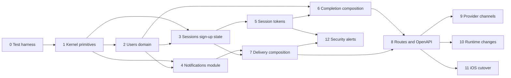

# Sign-up backend delivery plan

Status: Proposed

## Approval gates

Implementation cannot start before these approvals:

1. Add the `MoniPay.Users`, `MoniPay.Sessions`, and `MoniPay.Notifications` projects.
2. Change `server/MoniPay.slnx`, `server/Dockerfile`, and host composition.
3. Add the user, sign-up, session, consent, refresh-token, and notification schema.
4. Replace the POC `POST /signup` contract with the proposed route set.
5. Add `Testcontainers.PostgreSql` to the test project and `server/compose.yaml` to the server root.
6. Select the SMS provider and the email provider.
7. Accept the legal terms and privacy version identifiers.

KYC has its own later approval gate. The current repository does not define its production states or provider.

## Delivery order

Each pull request stays below 500 changed code lines and 10 code files. Documentation and generated OpenAPI files do not count toward that limit.

Every change lands with its tests. A change without tests is not complete.



Change 2 precedes 3 and 4 because it creates the migration infrastructure (the first migration, `dotnet-ef` in the tool manifest, the `Migrations/` and `Architecture/` test classes) the other two extend.

The GitHub issues (#79 to #113, grouped under epics #75 to #78) are the operational form of this plan; each names the exact types, files, options and acceptance checks of its pull request.

### Change 0: test harness

Scope: `server/tests/MoniPay.Tests/` and its package references only.

Add:

- `Testcontainers.PostgreSql` and `Npgsql` package references; both versions are already pinned centrally
- `Support/MoniPayApi.cs` assembly fixture with one PostgreSQL container and `ApplyMigrationsOnStartup = true`
- `Support/TestTimeProvider.cs`, `TestKeys.cs`, `TestPhones.cs`
- `Support/JsonApiAssertions.cs`, `ProblemDetailsAssertions.cs`, `DatabaseAssertions.cs`
- `Fakes/StubHandler.cs`
- Migration of the two host-booting tests (`HealthEndpointsTests`, `WalletLocalizationTests`) onto the fixture; `WalletEndpointsTests` and `MoneyTests` do not boot the host and stay as they are

Acceptance:

- `dotnet test server/MoniPay.slnx` starts one container and passes.
- The two migrated tests keep their assertions unchanged.
- A test can advance time through the fixture.

See [Testing strategy](testing-strategy.md#the-test-host).

### Change 1: shared primitives

Scope: `MoniPay.Kernel` and Kernel tests.

Add:

- `UserId`
- `CountryPhoneRule`, `PhoneNumber`, `EmailAddress`, `PersonName` value types with normalization
- `Http/` JSON:API records and `MoniPayMediaTypes`
- `Validation/` records, `ValidationCodes`, and `ValidationException`
- `RefusalException` (carrying a `System.Net.HttpStatusCode`: Kernel has no ASP.NET Core reference) and `ProviderUnavailableException`
- `MoniPayHeaders`, `MoniPayPolicies`, `MoniPayClaimTypes`, `MoniPayConventions`
- Sign-up, session, and notification entries in `MoniPayErrorTypes`

This is three pull requests (value types; HTTP records and constants; validation, refusal and error types) because the change is about twenty files.

Acceptance:

- Phone normalization accepts the supported sign-up countries.
- Invalid lengths and country codes fail deterministically.
- Email and name normalization match [Validation, guards, and error handling](validation-and-errors.md#normalization).
- No module-specific business rule enters Kernel.

### Change 2: Users domain and persistence

Scope: `MoniPay.Users`, module tests, and one EF migration.

Add:

- `User` and `UserConsent` entities
- `RegisterUserHandler` and `RegisterUserCommand`
- `UserPersonalDataProtector` and `UserLookupDigest`
- EF configurations with named constraints
- Unique indexes for `sign_up_id`, phone hash, and email hash
- The first migration of the repository, `dotnet-ef` in `dotnet-tools.json`, and the `Migrations/SchemaTests.cs`, `Architecture/ModuleBoundaryTests.cs` and `Architecture/PublicSurfaceTests.cs` classes

Two pull requests: the project with its schema, then the handler. Do not add HTTP routes in this change.

Acceptance:

- The same `SignUpId` returns the same user.
- A duplicate verified phone raises `phone-already-registered`.
- A duplicate normalized email raises `email-already-registered`.
- Stored rows contain no plaintext personal data.
- The generated migration SQL has the documented tables and indexes.

### Change 3: Sessions sign-up state

Scope: `MoniPay.Sessions`, module tests, and one EF migration.

Add:

- `SignUp` aggregate and `SignUpStatus`, with `locked_until` in the schema
- `VerificationCodeGenerator` and `VerificationCodeDigest`
- `SignUpTokenFactory`, `SignUpTokenDigest`, `RegistrationTokenFactory`, `RegistrationTokenDigest`
- `IVerificationCodeSender` and `IRegisteredPhoneLookup` ports
- `StartSignUpHandler`, `GetSignUpHandler`, `CreateVerificationCodeDeliveryHandler`, `CreatePhoneVerificationHandler`
- Persistent attempt and resend limits
- `SessionsOptions` with startup validation

Three pull requests: the project with the aggregate and its schema, the security primitives, the handlers with the ports. Tests use a recording sender fake and a stub phone lookup until the host adapters land. Do not add a production SMS fallback.

Acceptance:

- Resend invalidates the prior code.
- Resend does not reset failed attempts.
- Expired codes do not verify.
- The sign-up can still resend after a code expires.
- Attempt exhaustion locks verification.
- The stored code and tokens are digests.
- Parallel verifications produce one success.

### Change 4: Notifications module

Scope: `MoniPay.Notifications`, module tests, and one EF migration.

Add:

- `Notification` entity and `NotificationStatus`
- `NotificationOutbox` (with `FindLatestStatusAsync`), `OutboundMessage`, `DeliverySignal`, `NotificationCommitInterceptor`
- `NotificationWorker`, `NotificationProcessor`, `RetrySchedule`
- `DeliveredNotificationPurgeService`
- `ISmsChannel`, `IEmailChannel`, `ChannelResult`; no channel registered before the provider is selected
- `RecipientProtector`
- `NotificationsOptions` with startup validation

Two pull requests: the project with the outbox, signal and schema, then the worker, schedule, purge and channel contract with the recording channels.

Acceptance:

- A row enqueued in a transaction is visible to the worker only after commit.
- Two parallel cycles send one message once.
- A retryable failure follows the schedule and then fails.
- An expired message is never sent.
- The body ciphertext is cleared after delivery.
- The worker is off in the test host and driven per cycle.

See [Notification architecture](notifications.md).

### Change 5: session tokens and authentication

Scope: `MoniPay.Sessions`, host pipeline, and integration tests.

Add:

- `AccessTokenIssuer` and `RefreshTokenFactory`
- `Session` and `RefreshToken` entities with rotation and replay detection
- `SessionTokenService`
- `SignUpAuthenticationHandler` and `RegistrationAuthenticationHandler`
- JWT bearer authentication with previous-key support
- Named policies and rate-limit policies, with the forwarded-headers configuration the IP partitioning needs
- `ExpiredCredentialCleanupService`

Three pull requests: the schema and cleanup, the token service, the schemes and policies. The JWT bearer package already has a central version. Add no package version to a project file.

Acceptance:

- The bearer middleware validates issuer, audience, signature, and lifetime.
- A token signed with the previous key validates until it expires.
- Refresh rotates the token.
- Refresh replay revokes the token family.
- Revocation prevents future refresh.
- Each scheme rejects the other schemes' tokens.
- Cleanup deletes expired sign-ups and keeps active sessions.

### Change 6: sign-up completion composition

Scope: `MoniPay.Sessions`, `MoniPay.Users`, and the host adapter. This is one cross-module contract change.

Add:

- `IUserProvisioning`, `ProvisionUserRequest` (returns `UserId`)
- `UserProvisioningAdapter` and `RegisteredPhoneLookupAdapter` in the host, `PhoneRegistrationLookup` in Users
- `CreateSignUpCompletionHandler`
- Atomic user and bootstrap-session creation
- Safe completion retry

Acceptance:

- Completion creates one user and one active bootstrap session.
- A failed transaction creates neither resource.
- A retry returns a replacement session without a second user.
- Parallel completions create one user.
- Sessions and Users have no project reference to each other.

### Change 7: delivery composition

Scope: `MoniPay.Sessions`, `MoniPay.Users`, `MoniPay.Notifications`, and the host adapters.

Add:

- `VerificationCodeDeliveryAdapter` in the host
- `IWelcomeMessageSender` port in Users and `WelcomeMessageDeliveryAdapter` in the host
- Localized message rendering in `SessionMessages.resx` and `UserMessages.resx`
- `codeDelivery` projection on the sign-up read model, through `IVerificationCodeSender.GetLatestDeliveryAsync`

Two pull requests: the verification code, then the welcome email.

Acceptance:

- Starting a sign-up enqueues one SMS in the same transaction.
- The rendered SMS is French by default and English on request.
- The SMS contains the code and its lifetime, and nothing personal.
- A welcome email is enqueued in the registration transaction; an exception from its port is swallowed with a `Warning`, and a delivery failure is dropped, so neither affects sign-up.
- No module references another module.

### Change 8: routes, contracts, and OpenAPI

Scope: slice endpoints in both modules, the host error handling, and endpoint tests.

Add:

- Every route in [HTTP contract](http-contract.md)
- Slice resource and attribute records
- `JsonApiTransportMiddleware`
- `MoniPayExceptionHandler`, `MoniPayProblemDetailsWriter`, `ValidationProblemItem`
- Route, operation, tag, summary, policy, and rate-limit constants
- OpenAPI metadata with both media types
- Regenerated `docs/api/openapi.json`

Acceptance:

- Every endpoint uses `TypedResults`.
- Every endpoint calls one `HandleAsync`.
- Every handler accepts and forwards `CancellationToken`.
- Resource records remain internal.
- Every documented status has a test.
- The generated OpenAPI document matches [HTTP contract](http-contract.md).

This change exceeds the size limit as one pull request. It is five: host error handling first; then the sign-ups group with its start and get routes, the sessions group, and the users group, in parallel; then the sign-up command routes (resend, verify, complete), which reuse the `sessions` resource record the sessions group owns.

### Change 12: security alerts

Scope: `MoniPay.Sessions`, `MoniPay.Users`, `MoniPay.Notifications`, and the host adapter.

Add:

- `ISecurityAlertSender` and `SecurityAlert` in Sessions
- `UserContactLookup` in Users
- `SecurityAlertDeliveryAdapter` in the host
- `RefreshTokenReuseDetected` (required, SMS and email) from `SessionTokenService`, and `SessionRevoked` (optional, email) from the revocation slice, with their `.resx` entries

Acceptance:

- A refresh-token replay enqueues one SMS and one email for the family's user, in the transaction that revokes the family.
- A revocation enqueues one optional email; a failing port leaves the revocation committed.
- Rendered text names the time and the product only.

### Change 9: provider channels

Scope: `MoniPay.Notifications` only, one provider per pull request.

Add the selected SMS provider and the selected email provider as typed `HttpClient` channels.

Acceptance:

- Provider DTOs stay internal.
- Every documented provider response maps to one `ChannelResult`.
- Logs contain no recipient, body, or provider payload.
- Timeouts and cancellation propagate.
- The idempotency key reaches the provider when it supports one.
- Sandbox smoke runs manually with provider-owned test numbers only.

### Change 10: runtime changes

Scope: `server/Dockerfile`, `server/compose.yaml`, `appsettings.json`, and the release workflow.

Add:

- `icu-libs` in the runtime image (the project `COPY` lines arrived with each module)
- Every new configuration key with its default or an empty secret value
- The migration bundle step in the release workflow, with the `has-pending-model-changes` check in CI and release
- `server/compose.yaml`

Two pull requests: the image, Compose and configuration; the release workflow.

Acceptance:

- The image boots with only environment variables and refuses to start when a secret is missing.
- A French `Accept-Language` request to the container returns a French title.
- `docker compose -f server/compose.yaml up -d` gives a working local database.

See [Runtime and deployment](runtime-and-deployment.md).

### Change 11: iOS contract cutover

Scope: `ios/` and the generated OpenAPI contract. This is the client half of the contract change.

The iOS work must:

- Start sign-up from the phone step.
- Poll `GET /signups/{signUpId}` for `codeDelivery` before offering a resend.
- Call the real verify and resend routes.
- Keep the passcode and Face ID on the device.
- Complete sign-up from the profile step.
- Store the refresh token in device-only Keychain storage.
- Keep the access token in memory.
- Restore the session with the refresh route.
- Stop creating a local authenticated user after a backend error.
- Route to KYC only after sign-up completion succeeds.
- Load the profile from `GET /users/me` after completion and at restore, and build the local `User` from it.

The client must not send passcode or biometric data.

Four pull requests, by layer: the sign-up routes and JSON:API decoding in `ApiClient`; `CredentialStoring` and the Keychain store in `Platform` with the session and current-user routes and `SessionStore` in `ApiClient` (`ApiClient` gains its first package dependency, `Platform`); the phone and code steps on the real routes; completion, session restore at launch, and the removal of `AccountCreating` and the demo-mode fallback.

## Test plan

[Testing strategy](testing-strategy.md) defines the test types, the harness, and the rules. The lists below are the minimum per area.

### Domain tests

- Phone, email, and name normalization
- Sign-up state transitions
- Code expiry and sign-up expiry
- Resend cooldown and resend count
- Wrong-code attempt count and lock
- Digest determinism and constant length
- Token format and uniqueness
- Access-token claims

### Slice and database tests

- Unique phone hash, email hash, and `SignUpId`
- Concurrent code verification
- Concurrent sign-up completion
- Transaction rollback across the host adapter
- Refresh-token rotation under concurrency
- Notification claim, retry, expiry, and purge
- Migration from an empty database

### HTTP tests

- Every documented status code
- Every route constant and operation name
- Media-type negotiation
- Validation pointers
- English and French Problem Details
- `Retry-After` on rate limits
- `Cache-Control: no-store` on credential routes
- No account enumeration before phone verification
- OpenAPI request and response schemas
- Cancellation propagation

### Security tests

- Expired, wrong-issuer, wrong-audience, and wrong-key JWT rejection
- Scheme isolation between Sign-up, Registration, and Bearer tokens
- Registration token bound to its route `signUpId`
- Refresh-token family revocation after replay
- No credential or personal data in captured logs or table rows

## Verification commands

Run these commands after each backend change:

```bash
dotnet build server/MoniPay.slnx --configuration Release
dotnet test server/MoniPay.slnx
dotnet format server/MoniPay.slnx --verify-no-changes
```

Run these commands after an endpoint or contract change:

```bash
./scripts/update-openapi.sh
./scripts/check-openapi-sync.sh
```

Review generated migration SQL before merge.

## Prototype traceability

| Prototype behavior | Production backend change |
|---|---|
| Phone length controls the first CTA. | The server repeats country and length validation. |
| The first CTA advances without a server call. | `POST /signups` stores the sign-up and queues the real code. |
| Any six-digit code succeeds. | `POST /signups/{id}/phone-verifications` checks a keyed digest, expiry, and attempt limit. |
| The resend timer is local only. | `POST /signups/{id}/verification-code-deliveries` enforces the cooldown and rotates the code. |
| The passcode exists in JavaScript memory. | iOS stores it locally. The backend never receives it. |
| Face ID is simulated. | iOS enrolls local authentication. The backend never receives biometric data. |
| The profile step calls `POST /signup`. | `POST /signups/{id}/completions` creates the user and first session atomically. |
| The profile is stored in `localStorage`. | iOS stores only session credentials in secure storage. |
| A server error falls back to demo mode. | Production sign-up remains incomplete and shows an error. |
| KYC follows profile completion. | KYC remains a separate module after authenticated sign-up. |
| The POC creates a card-provider customer during sign-up. | Card-provider creation moves to `MoniPay.Cards`. |

## Deliberate omissions

This design does not add:

- Password authentication
- Existing-user sign-in, designed in [Sign-in and device change](sign-in.md) and delivered after this plan in four pull requests, including the breaking `verification-*` rename
- Email verification
- Social sign-in
- Customer roles
- Admin or support access
- Multi-device session management UI
- Device proof-of-possession
- Push or in-app notifications
- KYC states or provider integration
- Card-provider customer creation
- A compatibility `/signup` endpoint
- A runtime mock or demo fallback
- A cache, a broker, or OpenTelemetry exporters

Add one of these only after its own requirement exists.
