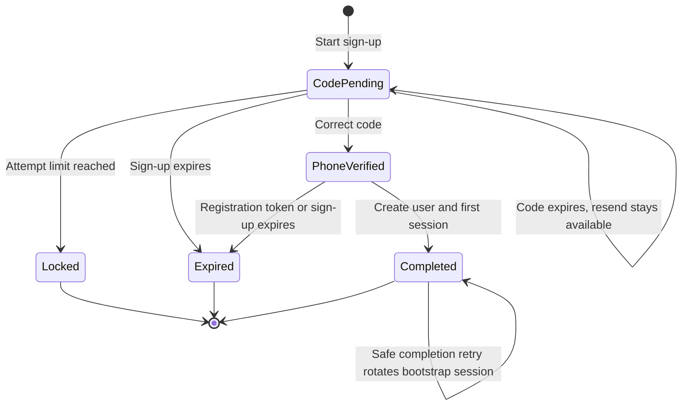

# Sign-up domain and state

Status: Proposed

## Domain language

Use these terms in C#, routes, tables, tests, and logs:

| Term | Meaning | Do not use as a synonym |
|---|---|---|
| `User` | The MoniPay account holder. | Customer, client |
| `SignUp` | Phone proof, user creation, and the first session. | KYC, account opening |
| `PhoneVerification` | Proof that the person controls the supplied phone number. | Identity verification, KYC |
| `VerificationCode` | A short-lived secret sent for phone verification. | Passcode, PIN |
| `Passcode` | The device-local secret that unlocks the app. | Verification code, backend password |
| `Session` | A revocable authenticated relationship between a user, a device, and MoniPay. | User, account |
| `Kyc` | Civil-identity verification after sign-up. | Phone verification |

The root `CONTEXT.md` contains the same domain definitions.

## Sign-up boundary

Sign-up ends when these facts are true:

- The backend verified the phone number.
- `MoniPay.Users` created one user.
- `MoniPay.Sessions` created one active session.
- The client received an access token and a refresh token.

KYC is not a sign-up state. The current app lets the user postpone KYC, and the repository has no accepted KYC state model.

Card-provider customer creation is not a sign-up step. `MoniPay.Cards` creates provider resources only when card issuance needs them.

## Aggregate

`SignUp` is the aggregate root in `MoniPay.Sessions`.

It owns:

- `Id`
- The encrypted phone number
- The keyed phone lookup hash
- The stored locale
- The verification-code digest
- Code and sign-up expiry times
- The failed-attempt count
- The resend count
- The registration-token digest
- The legal document versions shown by the client
- The current `SignUpStatus`
- The created `UserId` and bootstrap `SessionId`, after completion
- Audit timestamps from `TimeProvider`

It does not own:

- First name, last name, email, or user profile state
- A passcode
- Biometric data
- KYC documents or KYC status
- Card-provider customer data

## State machine

## Transition rules

| Transition | Required facts | Result |
|---|---|---|
| Start | Valid phone, legal document versions, and rate-limit capacity | Store a digest before SMS delivery. Return `CodePending`. |
| Resend | `CodePending`, cooldown elapsed, and resend capacity | Replace the digest. Invalidate the old code. |
| Wrong code | `CodePending` and code not expired | Increment the attempt count. Never reveal the expected code. |
| Verify phone | `CodePending`, matching code, and remaining attempts | Clear the code digest. Create a high-entropy registration token. |
| Complete | `PhoneVerified`, valid registration token, and valid profile | Create the user and session in one database transaction. |
| Retry complete | `Completed` and valid registration token | Revoke the prior bootstrap session. Return a new session. |
| Code expires | `CodePending` and sign-up remains active | Reject the code. Keep resend available. |
| Expire | The sign-up lifetime elapsed | Refuse further mutation. The client starts a new sign-up. |
| Lock | The verification-attempt limit was reached | Refuse code checks until the lock period ends. |

A resend never resets failed attempts. Otherwise, an attacker can bypass the attempt limit with repeated resends.

## Invariants

### Sign-up invariants

- One active sign-up can exist for one normalized phone hash.
- One verification code is valid for a sign-up at one time.
- The backend stores only a keyed digest of the verification code.
- A correct code creates a high-entropy registration token.
- The registration token authorizes only sign-up completion.
- Completion creates the user and session atomically.
- Completion cannot create two users for one phone.
- Completion retries leave one active bootstrap session.
- The response never reveals whether an unverified phone already belongs to a user.

### User invariants

- `users.phone_lookup_hash` is unique.
- `users.email_lookup_hash` is unique after email normalization.
- The user stores a BCP-47 locale from the supported culture set.
- The user stores each accepted legal document version and its acceptance time.
- `MoniPay.Users` owns profile mutation.
- Other modules use `UserId`. They do not open the `users` table.

### Session invariants

- Access tokens have a short lifetime.
- Refresh tokens are opaque, random, and stored as digests.
- Refresh rotates the token on every successful use.
- Refresh-token reuse revokes the token family.
- Session revocation invalidates future refreshes.
- A session stores a device identifier. The identifier is not an authentication secret.

## Data classification

| Data | Classification | Storage rule |
|---|---|---|
| Verification code | Authentication secret | Keep only a keyed digest. Remove it after verification or expiry. |
| Registration token | Authentication secret | Return once. Keep only a keyed digest. |
| Refresh token | Authentication secret | Keep only a SHA-256 digest. |
| Access token | Bearer credential | Do not persist the raw token. |
| Phone and email | Personal data | Encrypt values. Use keyed hashes for lookup and uniqueness. |
| First and last name | Personal data | Encrypt values. Never include them in access-token claims. |
| Passcode | Device secret | Keep it outside the backend. |
| Biometric data | Device biometric data | Never send it to MoniPay. |
| KYC documents | Restricted identity data | Keep them in `MoniPay.Kyc` or the selected KYC provider. |

## KYC decision gate

The repository states that the real KYC states, provider, limits, and policies are not defined.

This design does not invent them. Before `MoniPay.Kyc` implementation starts, product and compliance must define:

- The KYC provider
- Accepted document types
- State names and transitions
- Manual-review behavior
- Rejection and retry behavior
- Expiry and re-verification rules
- Operations that require completed KYC
- Data retention and deletion rules

Until that decision exists, do not add `KycVerified` claims or a `users.kyc_verified` column.
