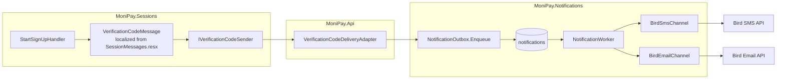

# Notification architecture

Status: Proposed

## Purpose

Sign-up sends one verification code by SMS. Sign-up completion and session security later send a welcome message and security alerts. This document defines the module that delivers them, the channels it supports, and the boundary between the module that writes a message and the module that sends it.

## Decision

Add `MoniPay.Notifications` as the single delivery module. It owns channels, providers, retries, delivery records, and recipient protection. It owns no message text.

The module that has the business event writes the localized message and enqueues it. `MoniPay.Sessions` writes the verification code message. `MoniPay.Users` writes the welcome message.

Delivery is asynchronous through an outbox row written in the same transaction as the domain change. A background worker claims the row, calls the provider, and records the result. The HTTP request never calls an SMS or email provider.

This applies the top-level rule: record first, call the provider later. See `agents/rules/patterns-outbox-and-background-work.md`.

## Why the verification code goes through the outbox

The request already returns `202 Accepted`. The provider call is the slow and unreliable part: a 20-second provider timeout on the request thread blocks a Kestrel worker, and a crash between the commit and the provider call loses the message with no retry.

The outbox worker wakes on a signal, so a healthy provider still receives the message within milliseconds of the commit. A lost signal costs one poll interval, not the message.

The client learns the delivery result from `GET /signups/{signUpId}`, through the `codeDelivery` attribute. See [HTTP contract](http-contract.md#get-sign-up-state).

## Channels

| Channel | First use | Provider | Status |
|---|---|---|---|
| SMS | Verification code | Bird | Selected, see `docs/adr/0004-sms-provider.md` |
| Email | Welcome message, security alerts | Bird ([ADR 0005](../../adr/0005-email-provider.md)) | Selected; needs an API key and a verified sender |
| Push | Later: session alerts, transaction receipts | APNs through a provider or direct | Out of scope: needs device-token registration |
| In-app | Later: the iOS `AppNotification` feed | MoniPay API | Out of scope: needs a notifications read route |

The first implementation delivers SMS and email. Push and in-app need their own design after device registration exists.

## Message catalog for sign-up and sessions

| Message | Channel | Written by | Trigger | Required |
|---|---|---|---|---|
| `VerificationCode` | SMS | Sessions, Start and Resend slices | Sign-up started or code resent | Yes |
| `Welcome` | Email | Users, Registration slice | User created | No, skipped when email delivery is unavailable |
| `SessionRevoked` | Email | Sessions, RevokeCurrent slice | User revoked a session | No |
| `RefreshTokenReuseDetected` | SMS and email | Sessions, `SessionTokenService` | Token family revoked after replay | Yes |
| `NewDeviceSignIn` | SMS | Sessions, sign-in VerifyPhone slice | A sign-in on a device with no prior session | Yes |

A required message that cannot be delivered after all retries raises an alert. An optional message that fails is logged and dropped.

The three security alerts go through one Sessions port, `ISecurityAlertSender`, keyed by `UserId`: Sessions holds no contact data, so the host adapter resolves the phone, the email and the locale through the public Users slice `UserContactLookup` before it enqueues.

Sign-up does not send a completion SMS. The user is on the device that completed sign-up.

## Ownership boundary



`MoniPay.Sessions` declares the port `IVerificationCodeSender`. `MoniPay.Api` implements it with `VerificationCodeDeliveryAdapter`, which calls the public `NotificationOutbox` of `MoniPay.Notifications`. Neither module references the other.

The same shape serves `MoniPay.Users` through `IWelcomeMessageSender` and `WelcomeMessageDeliveryAdapter`.

This is the `UserProvisioningAdapter` pattern from [.NET module design](dotnet-module-design.md#host-composition-layout), applied a second time.

## `MoniPay.Notifications` layout

```text
server/src/MoniPay.Notifications/
  MoniPay.Notifications.csproj
  NotificationsModule.cs
  NotificationsOptions.cs
  Features/
    Enqueue/
      NotificationOutbox.cs
      OutboundMessage.cs
      NotificationChannel.cs
      DeliverySignal.cs
    Deliver/
      NotificationWorker.cs
      NotificationProcessor.cs
      DeliveryOutcome.cs
    Purge/
      DeliveredNotificationPurgeService.cs
  Domain/
    Notification.cs
    NotificationStatus.cs
    RetrySchedule.cs
  Persistence/
    NotificationConfiguration.cs
    NotificationSets.cs
    NotificationCommitInterceptor.cs
  Security/
    RecipientProtector.cs
  Channels/
    INotificationChannel.cs
    ChannelResult.cs
    BirdSmsChannel.cs
    BirdEmailChannel.cs
```

The test suite uses two `RecordingChannel` instances from `MoniPay.Tests/Fakes/`, one keyed `Sms` and one keyed `Email`.

## Public interface

Only these types are public:

- `NotificationsModule`
- `NotificationOutbox`
- `OutboundMessage`
- `NotificationChannel`
- `NotificationStatus`, because `NotificationOutbox.FindLatestStatusAsync` returns it

`OutboundMessage` carries:

| Member | Meaning |
|---|---|
| `Channel` | `Sms` or `Email` |
| `Recipient` | The normalized phone or email |
| `Subject` | Email subject, `null` for SMS |
| `Body` | The already localized text |
| `Kind` | A stable message kind for metrics, such as `VerificationCode` |
| `Required` | Whether exhausted retries raise an alert |
| `IdempotencyKey` | One delivery per business event |
| `ExpiresAt` | After this time the message is useless and is not sent |
| `CorrelationId` | The sign-up, user, or session identifier for logs |

`ExpiresAt` matters for the verification code. A code that expires at 19:05 must not be sent at 19:07 after a provider outage. The worker marks it `Expired` instead.

## Enqueue

```csharp
public sealed class NotificationOutbox(
    MoniPayDbContext database,
    RecipientProtector recipients,
    TimeProvider timeProvider)
{
    public void Enqueue(OutboundMessage message);

    public Task<NotificationStatus?> FindLatestStatusAsync(
        Guid correlationId,
        string kind,
        CancellationToken cancellationToken);
}
```

`Enqueue` adds a `Notification` row to the caller's `MoniPayDbContext`. It does not save. The calling handler's `SaveChangesAsync` commits the sign-up and the notification together.

`FindLatestStatusAsync` is the read behind `codeDelivery`: the host adapter for `IVerificationCodeSender` calls it with the sign-up identifier and the `VerificationCode` kind, so Sessions learns the delivery state without opening the `notifications` table.

The signal is raised only after the transaction commits, by `NotificationCommitInterceptor` (a `SaveChangesInterceptor` that also listens to the transaction's commit when one is open). A signal raised before the commit would wake the worker to find nothing. `MoniPay.Data` never references the module: the interceptor reaches the `DbContext` options through a Kernel-declared contributor collection the host composes.

## Deliver

`NotificationWorker` is a `BackgroundService`. Each cycle:

1. Create a scope.
2. Claim up to `BatchSize` rows with `SELECT ... FOR UPDATE SKIP LOCKED` where `status = 'Pending'` and `next_attempt_at <= now`, setting `lease_until`.
3. For each row, skip and mark `Expired` when `expires_at <= now`.
4. Call the channel with a per-message timeout from `NotificationsOptions.ProviderTimeout`.
5. On success, set `status = 'Sent'`, `sent_at`, and `provider_reference`, and clear the body ciphertext.
6. On a retryable failure, increase `attempts`, set `next_attempt_at` from `RetrySchedule`, and store the provider result code.
7. On a permanent failure or exhausted attempts, set `status = 'Failed'` and `last_error_code`.
8. Save and release the lease.

Retry schedule for a verification code: 5 seconds, 30 seconds, 2 minutes, then `Failed`. The code lifetime is 5 minutes, so a longer schedule sends a dead code.

Retry schedule for other messages: 1 minute, 5 minutes, 15 minutes, 1 hour, then `Failed`.

The worker options gate it: `MoniPay:Notifications:Worker:Enabled`, `PollInterval`, `BatchSize`, `LeaseDuration`. The test host disables the worker and drives one cycle at a time.

Several API replicas can run the worker. `SKIP LOCKED` and the lease prevent two replicas from sending one message.

## Channel contract

```csharp
internal interface INotificationChannel
{
    Task<ChannelResult> SendAsync(
        Guid notificationId,
        string recipient,
        string? subject,
        string body,
        string idempotencyKey,
        CancellationToken cancellationToken);
}
```

`ChannelResult` is `Accepted(providerReference)`, `Retry(code)`, or `Rejected(code)`. The channel maps every provider status to one of the three. The processor never reads a provider payload.

A provider that supports an idempotency key receives `idempotencyKey`, so a retry after a lost response does not send twice. Bird replays the retained response for the same key within its idempotency window; see `docs/adr/0004-sms-provider.md`.

Each channel is a typed `HttpClient` registered with `AddHttpClient<BirdSmsChannel>` / `AddHttpClient<BirdEmailChannel>` plus a keyed `INotificationChannel` factory for `NotificationChannel.Sms` / `NotificationChannel.Email`, with the provider credentials from validated options. The SMS channel is registered, and its settings validated, only when `MoniPay:Notifications:Sms` supplies an API key or a sender ID; without them no SMS channel exists and the processor's channel-not-configured path keeps the rows waiting. The email settings are always validated at startup. The SMS `HttpClient.Timeout` is infinite: the processor deadline from `NotificationsOptions.ProviderTimeout` stays authoritative through the linked token, and the response body is read through a bounded buffer. Retries belong to the worker schedule, so no HTTP resilience package is added. Redirects are disabled so a provider redirect can neither forward credentials nor silently change submission semantics.

A channel returns, it does not throw: a transport exception, a timeout, a malformed body or a fault inside the adapter becomes `Retry` or `Rejected` with a stable code. Caller cancellation propagates as `OperationCanceledException`.

No placeholder channel pretends to send. The processor resolves the channel with `GetKeyedService`; when none is registered it records `Retry` with the code `channel-not-configured`, logs one `Warning` per cycle, and the row waits in the outbox until a channel exists.

## Persistence

### `notifications`

| Column | Type | Rule |
|---|---|---|
| `id` | `uuid` | Primary key. |
| `channel` | `varchar(16)` | String enum. |
| `kind` | `varchar(48)` | Stable message kind. |
| `recipient_ciphertext` | `text` | Encrypted phone or email. |
| `recipient_hint` | `varchar(8)` | Last four digits or the domain, for support. |
| `subject_ciphertext` | `text`, nullable | Encrypted email subject. |
| `body_ciphertext` | `text`, nullable | Encrypted body. Cleared after delivery. |
| `required` | `boolean` | Alert on exhaustion. |
| `idempotency_key` | `varchar(128)` | Unique. |
| `correlation_id` | `uuid` | Sign-up, user, or session identifier. |
| `status` | `varchar(16)` | `Pending`, `Sent`, `Failed`, `Expired`. |
| `attempts` | `integer` | Attempts made. |
| `next_attempt_at` | `timestamptz` | Next eligible time. |
| `lease_until` | `timestamptz`, nullable | Claim lease. |
| `expires_at` | `timestamptz`, nullable | Message usefulness limit. |
| `provider_reference` | `varchar(128)`, nullable | Provider message identifier. |
| `last_error_code` | `varchar(64)`, nullable | Stable channel result code. |
| `created_at` | `timestamptz` | Audit time. |
| `sent_at` | `timestamptz`, nullable | Audit time. |

Indexes:

- `status`, `next_attempt_at` for claiming
- Unique `idempotency_key`
- `correlation_id` for support lookups

The body of a verification-code SMS contains the code. The body is encrypted with the notifications data key and cleared the moment the provider accepts the message. A database read after delivery reveals no code.

`DeliveredNotificationPurgeService` deletes `Sent`, `Failed`, and `Expired` rows older than `MoniPay:Notifications:Retention`, default 30 days, in bounded batches.

## Localization

The producing module renders the text with its own `IStringLocalizer` and the recipient's stored locale. Before a user exists, the sign-up row's locale is used.

```csharp
CultureInfo culture = CultureInfo.GetCultureInfo(signUp.Locale.Value);
string lifetimeMinutes = ((int)Math.Ceiling(codeLifetime.TotalMinutes)).ToString(CultureInfo.InvariantCulture);
CultureInfo currentCulture = CultureInfo.CurrentCulture;
CultureInfo currentUICulture = CultureInfo.CurrentUICulture;
try
{
    CultureInfo.CurrentCulture = culture;
    CultureInfo.CurrentUICulture = culture;
    string body = localizer[SessionMessageKeys.VerificationCodeSms, code, lifetimeMinutes];
}
finally
{
    CultureInfo.CurrentCulture = currentCulture;
    CultureInfo.CurrentUICulture = currentUICulture;
}
```

Keys are meanings, not sentences: `VerificationCodeSms`, `WelcomeEmailSubject`, `WelcomeEmailBody`, `RefreshTokenReuseDetectedSms`.

The verification SMS contains the code, its lifetime in minutes, and the product name. It contains no name, no phone, and no link.

Money and dates in a future receipt message are formatted with the recipient's culture, never with the server culture.

## Failure behavior

| Failure | Behavior |
|---|---|
| Enqueue fails | The adapter wraps the failure in `ProviderUnavailableException`; the whole sign-up transaction rolls back and the client receives `503 verification-delivery-unavailable`. |
| No email channel registered yet | The row stays `Pending` with `channel-not-configured`; delivery starts when the email channel ships. |
| Provider permanently rejects a verification code | Fail immediately. `codeDelivery` reports `failed`. Resend stays available. |
| Provider transiently fails a verification code | Retry on the short schedule. `codeDelivery` reports `queued` between attempts and `failed` after exhaustion. Resend stays available. |
| Provider accepts but the response is lost | The idempotency key prevents a duplicate on retry when the provider supports it. |
| Verification code expires before delivery | The row is marked `Expired`. The client resends. |
| Email provider is down | Welcome email fails after retries and is dropped. Sign-up is unaffected. |
| Required security alert exhausts retries | A `Critical` log event and a `notifications_required_failed` counter. Operations follows up. |
| Worker crashes mid-batch | Leases expire. Another cycle claims the rows. |

## Metrics and logs

Counters, labeled by `channel`, `kind`, and result code:

- `notifications_enqueued`
- `notifications_sent`
- `notifications_retried`
- `notifications_failed`
- `notifications_expired`
- `notifications_required_failed`

Histograms:

- `notifications_delivery_latency`, from `created_at` to `sent_at`
- `notifications_provider_duration`, per provider call

Log events carry `NotificationId`, `Kind`, `Channel`, `CorrelationId`, `Attempts`, `RecipientHint`, and the provider result code. They never carry the recipient, the body, the code, or a provider payload.

## Test doubles

`MoniPay.Tests/Fakes/RecordingChannel.cs` implements `INotificationChannel`, records every call, and returns a configurable `ChannelResult`. The test host registers one instance for SMS and one for email, after removing the production keyed SMS registration. A sign-up test runs a delivery cycle and reads the verification code from the recorded SMS body.

The test host sets `MoniPay:Notifications:Worker:Enabled` to `false`. A test calls `Api.RunNotificationCycleAsync()` to deliver. See [Testing strategy](testing-strategy.md#the-test-host).

Sign-up tests use the real outbox through the host `VerificationCodeDeliveryAdapter`. No recording sender masks production wiring.

## Provider decision gate

Both providers are Bird: SMS is decided in `docs/adr/0004-sms-provider.md`, email in [ADR 0005](../../adr/0005-email-provider.md), which records the sandbox, the response mapping, and the operational notes.

The gate in [Security and operations](security-and-operations.md#provider-decision-gate) lists what a provider decision must record. For email, that additionally covered the sending domain, DKIM and SPF setup, bounce handling, and a suppression list.

## Deliberate omissions

This design does not add:

- Push notifications
- An in-app notification read route
- Templates stored in the database
- User notification preferences
- Marketing messages
- A message queue broker; PostgreSQL is the queue

Add one of these when its requirement exists.

## References

- `agents/rules/patterns-outbox-and-background-work.md`
- `agents/rules/api-localization.md`
- `agents/rules/patterns-dotnet-dependency-injection.md`
- [BackgroundService in .NET](https://learn.microsoft.com/dotnet/core/extensions/workers)
- [IHttpClientFactory in .NET](https://learn.microsoft.com/dotnet/core/extensions/httpclient-factory)
