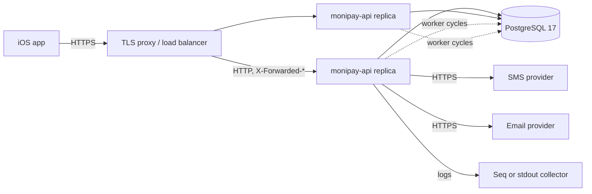

# Runtime and deployment

Status: Proposed

## Purpose

This document defines how the sign-up backend runs: the container image, the configuration it needs, the local development setup, the deployment topology, migrations, and the operational surface.

`agents/rules/reference-dotnet-local-dev.md` and `agents/rules/ci-dotnet-pipeline.md` describe the existing setup. This document extends it for the new modules.

## Runtime topology



- The API is stateless. Every replica serves every route and runs every worker.
- PostgreSQL is the only state. There is no Redis and no message broker in this design.
- TLS terminates at the edge. The API trusts `X-Forwarded-For` and `X-Forwarded-Proto` from the edge's addresses only.
- Workers coordinate through row leases, so any number of replicas is safe.

The in-process rate limiter counts per replica. The persistent per-phone limits in the database are the authoritative ones. Two replicas double the IP allowance; that is accepted for the first deployment.

## Container image

`server/Dockerfile` already builds a multi-stage Alpine image, runs as a non-root user, and exposes `8080` with a liveness `HEALTHCHECK`.

Required changes:

| Change | Reason |
|---|---|
| Add a `COPY` line for each new project file before `dotnet restore`, in the pull request that creates the project | The restore layer must see every project: the image does not build without the line, and the cache misses on every build without the ordering |
| Add `icu-libs` next to `tzdata` in the runtime stage | `fr-CM` resolves to the invariant culture without ICU, and every `.resx` lookup falls back to English |
| Keep `InvariantGlobalization` unset or `false` | Same reason |
| Add `HEALTHCHECK` unchanged | `/health` stays the liveness route |

`icu-libs` is a gap today, not only for sign-up: the Wallet localization tests pass on the SDK image because it has ICU, and the runtime image does not. Fix it in its own change before the first localized SMS ships.

The image does not contain `appsettings.Development.json`, user secrets, or any key. `server/.dockerignore` already excludes `bin/`, `obj/`, and `.git/`.

## Configuration

Every value is read through validated options with `ValidateOnStart`. A missing secret stops the host before it serves a request.

### Existing keys

| Key | Meaning |
|---|---|
| `ConnectionStrings:MoniPay` | PostgreSQL connection string |
| `MoniPay:ApplyMigrationsOnStartup` | `true` in development and tests only |
| `MoniPay:OpenApi:Enabled` | Serve the OpenAPI document |
| `Serilog:*` | Log levels and sinks |

### Sessions keys

| Key | Secret | Default |
|---|---|---|
| `MoniPay:Sessions:Issuer` | No | Required |
| `MoniPay:Sessions:Audience` | No | Required |
| `MoniPay:Sessions:SigningKeyBase64` | Yes | Required, 32 bytes |
| `MoniPay:Sessions:PreviousSigningKeyBase64` | Yes | Empty; set during rotation |
| `MoniPay:Sessions:VerificationCodeKeyBase64` | Yes | Required, 32 bytes |
| `MoniPay:Sessions:PersonalDataKeyBase64` | Yes | Required, 32 bytes |
| `MoniPay:Sessions:SupportedCountries` | No | The iOS `Country` list |
| `MoniPay:Sessions:VerificationCodeLength` | No | `6` |
| `MoniPay:Sessions:VerificationCodeLifetime` | No | `00:05:00` |
| `MoniPay:Sessions:ResendCooldown` | No | `00:01:00` |
| `MoniPay:Sessions:MaximumResends` | No | `3` |
| `MoniPay:Sessions:MaximumVerificationAttempts` | No | `5` |
| `MoniPay:Sessions:SignUpLifetime` | No | `00:15:00` |
| `MoniPay:Sessions:AccessTokenLifetime` | No | `00:10:00` |
| `MoniPay:Sessions:RefreshTokenLifetime` | No | `30.00:00:00` |
| `MoniPay:Sessions:ClockSkew` | No | `00:00:30` |
| `MoniPay:Sessions:Cleanup:Enabled` | No | `true` |
| `MoniPay:Sessions:Cleanup:Interval` | No | `00:10:00` |
| `MoniPay:Sessions:Cleanup:BatchSize` | No | `500` |
| `MoniPay:Sessions:Legal:TermsVersion` | No | Required |
| `MoniPay:Sessions:Legal:PrivacyVersion` | No | Required |
| `MoniPay:Sessions:LegacyVerificationProblemTypes` | No | `false`; `true` only during the sign-in rename rollout, then removed |

### Users keys

| Key | Secret | Default |
|---|---|---|
| `MoniPay:Users:PersonalDataKeyBase64` | Yes | Required, 32 bytes |

### Notifications keys

| Key | Secret | Default |
|---|---|---|
| `MoniPay:Notifications:DataKeyBase64` | Yes | Required, 32 bytes |
| `MoniPay:Notifications:Worker:Enabled` | No | `true` |
| `MoniPay:Notifications:Worker:PollInterval` | No | `00:00:05` |
| `MoniPay:Notifications:Worker:BatchSize` | No | `50` |
| `MoniPay:Notifications:Worker:LeaseDuration` | No | `00:01:00` |
| `MoniPay:Notifications:ProviderTimeout` | No | `00:00:10` |
| `MoniPay:Notifications:Retention` | No | `30.00:00:00` |
| `MoniPay:Notifications:Sms:BaseUrl` | No | `https://eu1.platform.bird.com` |
| `MoniPay:Notifications:Sms:ApiKey` | Yes | Required |
| `MoniPay:Notifications:Sms:SenderId` | No | Required, account-specific sender |
| `MoniPay:Notifications:Email:BaseUrl` | No | Provider value |
| `MoniPay:Notifications:Email:ApiKey` | Yes | Required once the provider is selected |
| `MoniPay:Notifications:Email:FromAddress` | No | Required once the provider is selected |

### Host keys

| Key | Meaning |
|---|---|
| `MoniPay:ForwardedHeaders:KnownProxies` | The edge addresses the host trusts; read by the forwarded-headers setup that ships with the rate limiter |
| `MoniPay:RateLimits:StartPerHour`, `ResendPerHour`, `VerifyPerHour`, `CompletePerHour`, `RefreshPerHour` | Per-route IP limits from [Security and operations](security-and-operations.md#rate-limits) |

Environment variables replace `:` with `__`: `MoniPay__Sessions__SigningKeyBase64`.

`appsettings.json` declares every non-secret key with its default and every secret key with an empty value. No environment file ever fills a secret in.

## Secrets

| Environment | Source |
|---|---|
| Local development | `dotnet user-secrets` on `server/src/MoniPay.Api` |
| Tests | Fixed test values set by the harness |
| CI | GitHub environment secrets, never echoed |
| Staging and production | Environment variables injected by the platform's secret store |

Local setup for the new keys:

```bash
for key in Sessions:SigningKeyBase64 Sessions:VerificationCodeKeyBase64 \
           Sessions:PersonalDataKeyBase64 Users:PersonalDataKeyBase64 \
           Notifications:DataKeyBase64; do
  dotnet user-secrets set "MoniPay:$key" "$(openssl rand -base64 32)" --project server/src/MoniPay.Api
done
dotnet user-secrets set "MoniPay:Sessions:Issuer" "https://api.monipay.local" --project server/src/MoniPay.Api
dotnet user-secrets set "MoniPay:Sessions:Audience" "monipay-ios" --project server/src/MoniPay.Api
```

### Key rotation

| Key | Rotation |
|---|---|
| Signing key | Set `PreviousSigningKeyBase64` to the old key and `SigningKeyBase64` to the new one. Tokens signed by either validate for one access-token lifetime. Then clear the previous key. |
| Verification-code key | Rotate freely. In-flight codes fail verification and the user resends. Rotate outside peak hours. |
| Personal-data keys | Require a re-encryption migration. Not supported in the first implementation; keep a versioned key identifier in the ciphertext prefix so a later migration can find rows by key. |
| Provider API keys | Rotate at the provider, then in the environment. A rejected request during the switch retries through the outbox. |

A leaked key is revoked at its source first, then replaced, then removed from history.

## Local development

The existing setup uses Homebrew PostgreSQL and `dotnet run`. It stays valid.

Add `server/compose.yaml` for a one-command environment:

```yaml
services:
  postgres:
    image: postgres:17-alpine
    environment:
      POSTGRES_DB: monipay
      POSTGRES_USER: monipay
      POSTGRES_PASSWORD: monipay
    ports:
      - "5432:5432"
    volumes:
      - postgres:/var/lib/postgresql/data
    healthcheck:
      test: ["CMD-SHELL", "pg_isready -U monipay"]
      interval: 5s

  seq:
    image: datalust/seq:latest
    environment:
      ACCEPT_EULA: "Y"
    ports:
      - "5341:80"

volumes:
  postgres:
```

`docker compose -f server/compose.yaml up -d` starts the database and the log viewer. The API still runs with `dotnet run`, so debugging and hot reload work. Running the API itself inside Compose is not needed for development.

The Compose password is a local development value for an unexposed container. Nothing in the file is a production secret.

Adding `server/compose.yaml` changes the `server/` root and needs approval under the repository's ask-first rule.

## Database

### Migrations

`MoniPay:ApplyMigrationsOnStartup` is `false` outside development and tests. A replica that migrates on boot races the other replicas during a rolling deploy.

Production migrations run as a separate step before the new image starts:

```bash
dotnet ef migrations bundle --project server/src/MoniPay.Data --startup-project server/src/MoniPay.Api \
  --configuration Release --output efbundle --self-contained
./efbundle --connection "$ConnectionStrings__MoniPay"
```

The bundle is built in the release workflow (`dotnet tool restore`, then `dotnet ef migrations has-pending-model-changes` to fail a release whose model has no migration, then the bundle for `linux-x64`) and attached to the GitHub release as `efbundle-linux-x64`. The deployment downloads it and runs it before the rollout. It is idempotent and applies only pending migrations. `dotnet-ef` lives in `dotnet-tools.json`, added with the first migration.

Every migration is expand-only during a rollout: add a column, add a table, add an index. A destructive change waits one release, so the previous image still works against the new schema.

### Indexes

Sign-up tables receive frequent inserts and short-lived rows. The cleanup worker keeps `sign_ups` small. The partial unique index on active phone hashes stays small because it excludes terminal rows.

### Backups

PostgreSQL backups are the platform's responsibility. The design needs point-in-time recovery, because a restored `users` table without its `sessions` rows logs every user out, and a restored `refresh_tokens` table older than a rotation makes every client look like a replay.

Encrypted personal data in a backup is unreadable without the keys. Keys live in the secret store, never in the backup.

## Workers

| Worker | Module | Coordination | Off in tests |
|---|---|---|---|
| `NotificationWorker` | Notifications | `SKIP LOCKED` leases | Yes |
| `DeliveredNotificationPurgeService` | Notifications | Bounded batches, idempotent deletes | Yes |
| `ExpiredCredentialCleanupService` | Sessions | Bounded batches, idempotent deletes | Yes |

Every worker creates a scope per cycle, catches its own exceptions, logs them, and continues. A worker failure never stops the host.

A worker honors `IHostApplicationLifetime` cancellation. A replica draining for a deploy finishes its current batch and releases its leases.

## Health

| Route | Checks | Used by |
|---|---|---|
| `/health` | Nothing; the process answers | Container `HEALTHCHECK` |
| `/health/ready` | Database reachable | Load balancer |

Provider reachability is not a readiness check. A provider outage must not remove replicas from the load balancer, because every route except delivery still works, and delivery retries through the outbox.

## Observability

Serilog is configured with console output and a Seq sink package. The request log is on.

Sign-up adds:

- Source-generated log events per outcome, with the field rules from [Security and operations](security-and-operations.md#logging).
- `System.Diagnostics.Metrics` counters and histograms from `MoniPay.Sessions` and `MoniPay.Notifications` meters, named in [Security and operations](security-and-operations.md#metrics) and [Notification architecture](notifications.md#metrics-and-logs).
- `Activity` propagation from `traceparent`, which ASP.NET Core does by default. The `traceId` in every Problem Details body is that activity's identifier.

Exporting metrics to a backend needs the OpenTelemetry packages. That is a new dependency and its own approved change. Until then, the meters exist and `dotnet-counters` reads them from a running container.

Log output in production is JSON on stdout, collected by the platform. Seq is a development convenience.

## Security hardening

- The container runs as `monipay`, not root.
- The file system is read-only except `/tmp`.
- No shell is needed at runtime; `wget` from BusyBox serves the health check.
- Kestrel serves HTTP only, behind the TLS edge. `UseHsts` runs outside development so the header reaches clients through the proxy.
- Request body size is capped on sign-up and session groups.
- `AllowedHosts` is set to the API host name in production, not `*`.
- Outbound calls go to the provider base URLs from configuration only.

## Deployment checklist

- [ ] Migration bundle applied and reported no error
- [ ] Every secret key set in the environment, validated by a dry `--dry-run` boot in the pipeline
- [ ] `MoniPay:ApplyMigrationsOnStartup` is `false`
- [ ] `MoniPay:ForwardedHeaders:KnownProxies` lists the edge addresses
- [ ] `MoniPay:Sessions:Issuer` and `Audience` match the iOS configuration
- [ ] `MoniPay:Sessions:Legal:*` match the documents the iOS app shows
- [ ] `/health/ready` returns `200` on every replica before traffic
- [ ] Worker logs show one cycle per replica
- [ ] A sign-up from a test phone receives its code within the poll interval
- [ ] Previous signing key cleared after rotation

## Deliberate omissions

This design does not add:

- Redis or another cache
- A message broker
- OpenTelemetry exporters
- A Kubernetes manifest or a platform-specific deployment file
- Blue-green or canary orchestration
- Multi-region deployment

Add one of these when its requirement exists.

## References

- `agents/rules/reference-dotnet-local-dev.md`
- `agents/rules/ci-dotnet-pipeline.md`
- `agents/rules/quality-secrets-and-config.md`
- `agents/rules/data-efcore-migrations.md`
- [Host ASP.NET Core in Docker](https://learn.microsoft.com/aspnet/core/host-and-deploy/docker/)
- [Configure ASP.NET Core to work with proxy servers and load balancers](https://learn.microsoft.com/aspnet/core/host-and-deploy/proxy-load-balancer)
- [EF Core migration bundles](https://learn.microsoft.com/ef/core/managing-schemas/migrations/applying#bundles)
- [.NET globalization-invariant mode](https://learn.microsoft.com/dotnet/core/runtime-config/globalization)
