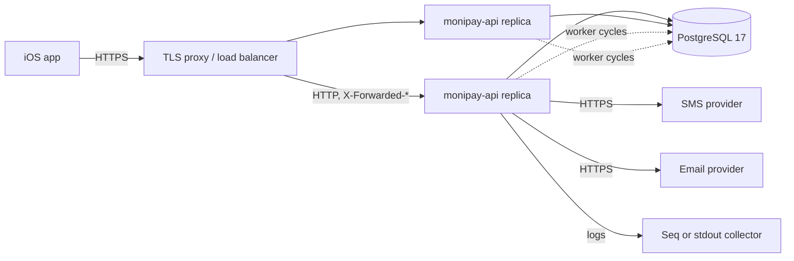

# Runtime and deployment

Status: Proposed

## Purpose

This document defines how the sign-up backend runs: the container image, the configuration it needs, the local development setup, the deployment topology, migrations, and the operational surface.

`agents/rules/reference-dotnet-local-dev.md` and `agents/rules/ci-dotnet-pipeline.md` describe the existing setup. This document extends it for the new modules.

## Runtime topology



- The API is stateless. Every replica serves every route and runs every worker.
- PostgreSQL is the only state. There is no Redis and no message broker in this design.
- TLS terminates at the edge. The API trusts `X-Forwarded-For` and `X-Forwarded-Proto` from the edge's addresses only.
- Workers coordinate through row leases, so any number of replicas is safe.

The in-process rate limiter counts per replica. The persistent per-phone limits in the database are the authoritative ones. Two replicas double the IP allowance; that is accepted for the first deployment.

## Container image

`server/Dockerfile` builds a multi-stage Alpine image, runs as a non-root user, and exposes `8080`
with a liveness `HEALTHCHECK`.

- The runtime stage installs `tzdata` and `icu-libs`, then sets
  `DOTNET_SYSTEM_GLOBALIZATION_INVARIANT=false`. Without ICU, `fr-CM` resolves to the invariant
  culture and every `.resx` lookup falls back to English.
- `dotnet publish` excludes `appsettings.Development.json` (`CopyToPublishDirectory="Never"` in
  `MoniPay.Api.csproj`), so the image carries no development settings, no user secrets and no
  credentials. `InvariantGlobalization` is not set anywhere.
- `server/.dockerignore` excludes `bin/`, `obj/`, and `.git/`.
- A new module adds its own `COPY …csproj` line before `dotnet restore`, in the pull request that
  creates the project.
- The container writes nothing outside `/tmp`; it runs with `--read-only --tmpfs /tmp`.

## Configuration

Every value is read through validated options with `ValidateOnStart`. A missing secret stops the host before it serves a request.

### Existing keys

| Key | Meaning |
|---|---|
| `ConnectionStrings:MoniPay` | PostgreSQL connection string |
| `MoniPay:ApplyMigrationsOnStartup` | `true` in development and tests only |
| `MoniPay:OpenApi:Enabled` | Serve the OpenAPI document |
| `Serilog:*` | Log levels and sinks |

### Sessions keys

| Key | Secret | Default |
|---|---|---|
| `MoniPay:Sessions:Issuer` | No | Required |
| `MoniPay:Sessions:Audience` | No | Required |
| `MoniPay:Sessions:SigningKeyBase64` | Yes | Required, 32 bytes |
| `MoniPay:Sessions:PreviousSigningKeyBase64` | Yes | Empty, accepted as unset; set during rotation |
| `MoniPay:Sessions:VerificationCodeKeyBase64` | Yes | Required, 32 bytes |
| `MoniPay:Sessions:PersonalDataKeyBase64` | Yes | Required, 32 bytes |
| `MoniPay:Sessions:SupportedCountries` | No | The six countries the iOS `Country` list ships |
| `MoniPay:Sessions:VerificationCodeLength` | No | `6` |
| `MoniPay:Sessions:VerificationCodeLifetime` | No | `00:05:00` |
| `MoniPay:Sessions:ResendCooldown` | No | `00:01:00` |
| `MoniPay:Sessions:MaximumResends` | No | `3` |
| `MoniPay:Sessions:MaximumVerificationAttempts` | No | `5` |
| `MoniPay:Sessions:SignUpLifetime` | No | `00:15:00` |
| `MoniPay:Sessions:StartWindow` | No | `01:00:00` |
| `MoniPay:Sessions:MaximumStartsPerWindow` | No | `5` |
| `MoniPay:Sessions:AccessTokenLifetime` | No | `00:10:00` |
| `MoniPay:Sessions:RefreshTokenLifetime` | No | `30.00:00:00` |
| `MoniPay:Sessions:ClockSkew` | No | `00:00:30` |
| `MoniPay:Sessions:Cleanup:Enabled` | No | `true` |
| `MoniPay:Sessions:Cleanup:Interval` | No | `00:10:00` |
| `MoniPay:Sessions:Cleanup:BatchSize` | No | `500` |
| `MoniPay:Sessions:Legal:TermsVersion` | No | Required |
| `MoniPay:Sessions:Legal:PrivacyVersion` | No | Required |

### Users keys

| Key | Secret | Default |
|---|---|---|
| `MoniPay:Users:PersonalDataKeyBase64` | Yes | Required, 32 bytes |

### Notifications keys

| Key | Secret | Default |
|---|---|---|
| `MoniPay:Notifications:DataKeyBase64` | Yes | Required, 32 bytes |
| `MoniPay:Notifications:Worker:Enabled` | No | `true` |
| `MoniPay:Notifications:Worker:PollInterval` | No | `00:00:05` |
| `MoniPay:Notifications:Worker:BatchSize` | No | `50` |
| `MoniPay:Notifications:Worker:LeaseDuration` | No | `00:01:00` |
| `MoniPay:Notifications:ProviderTimeout` | No | `00:00:10` |
| `MoniPay:Notifications:Retention` | No | `30.00:00:00` |
| `MoniPay:Notifications:Sms:BaseUrl` | No | `https://eu1.platform.bird.com` |
| `MoniPay:Notifications:Sms:ApiKey` | Yes | Required to enable SMS delivery |
| `MoniPay:Notifications:Sms:SenderId` | No | Required to enable SMS delivery, account-specific sender |
| `MoniPay:Notifications:Email:BaseUrl` | No | `https://eu1.platform.bird.com` |
| `MoniPay:Notifications:Email:ApiKey` | Yes | Required |
| `MoniPay:Notifications:Email:FromAddress` | No | Required, verified domain |

### Host keys

| Key | Meaning |
|---|---|
| `MoniPay:ForwardedHeaders:KnownProxies` | The edge addresses the host trusts; read by the forwarded-headers setup that ships with the rate limiter |
| `MoniPay:RateLimits:StartPerHour`, `ResendPerHour`, `VerifyPerHour`, `CompletePerHour`, `RefreshPerHour` | Per-route IP limits from [Security and operations](security-and-operations.md#rate-limits) |

Environment variables replace `:` with `__`: `MoniPay__Sessions__SigningKeyBase64`.

`appsettings.json` declares every active key: non-secret values with their default, secrets with an
empty value, and `SupportedCountries` with the six contract entries. `AllowedHosts` stays `*` there;
production sets it to the API host name, for example `AllowedHosts="api.example.com"`.
`MoniPay:ForwardedHeaders:KnownProxies` is an empty array until the edge addresses are known. No
environment file ever fills a secret in.

## Secrets

| Environment | Source |
|---|---|
| Local development | `dotnet user-secrets` on `server/src/MoniPay.Api` |
| Tests | Fixed test values set by the harness |
| CI | GitHub environment secrets, never echoed |
| Staging and production | Environment variables injected by the platform's secret store |

The five cryptographic keys are distinct and each decodes to 32 bytes. `PreviousSigningKeyBase64`
stays empty until a rotation. SMS enables only when both its API key and sender ID are set; a single
credential leaves it off without blocking startup. The bootstrap commands live in
`agents/rules/reference-dotnet-local-dev.md`.

### Key rotation

| Key | Rotation |
|---|---|
| Signing key | Set `PreviousSigningKeyBase64` to the old key and `SigningKeyBase64` to the new one. Tokens signed by either validate for one access-token lifetime. Then clear the previous key. |
| Verification-code key | Rotate freely. In-flight codes fail verification and the user resends. Rotate outside peak hours. |
| Personal-data keys | Require a re-encryption migration. Not supported in the first implementation; keep a versioned key identifier in the ciphertext prefix so a later migration can find rows by key. |
| Provider API keys | Rotate at the provider, then in the environment. A rejected request during the switch retries through the outbox. |

A leaked key is revoked at its source first, then replaced, then removed from history.

## Local development

`server/compose.yaml` starts PostgreSQL 17 and Seq; the API still runs with `dotnet run`, so
debugging and hot reload work. Running the API itself inside Compose is not needed.

```bash
export MONIPAY_POSTGRES_PASSWORD="$(openssl rand -base64 24)"
docker compose -f server/compose.yaml up -d --wait
docker compose -f server/compose.yaml ps
```

Ports bind to loopback and the database password arrives through `MONIPAY_POSTGRES_PASSWORD`; no
credential is committed. `docker compose -f server/compose.yaml down` stops both services and keeps
the named volume, so PostgreSQL data survives a restart; adding `-v` deletes the local data. Seq
runs without authentication for local viewing at <http://localhost:5341>.

The Homebrew option stays valid: `brew install postgresql@17 && brew services start postgresql@17`,
then `createuser --pwprompt monipay` and `createdb --owner monipay monipay`. Because both servers
bind `5432`, stop one before starting the other.

The connection string, the five keys, the issuer, the audience, the legal versions and the email
sender go into `dotnet user-secrets` as shown above. `MoniPay:ApplyMigrationsOnStartup` is `false`
in `appsettings.json`; initialize the schema with `dotnet ef database update`, or set the flag in
user secrets for a throwaway database. `agents/rules/reference-dotnet-local-dev.md` carries the
full sequence.

## Database

### Migrations

`MoniPay:ApplyMigrationsOnStartup` is `false` in `appsettings.json`, development included. A
replica that migrates on boot races the other replicas during a rolling deploy; locally, run
`dotnet ef database update` or opt in through user secrets for a throwaway database.

Production migrations run as a separate step before the new image starts:

```bash
dotnet ef migrations bundle --project server/src/MoniPay.Data --startup-project server/src/MoniPay.Api \
  --configuration Release --output efbundle --self-contained
./efbundle --connection "$ConnectionStrings__MoniPay"
```

The bundle is built in the release workflow (`dotnet tool restore`, then `dotnet ef migrations has-pending-model-changes` to fail a release whose model has no migration, then the bundle for `linux-x64`) and attached to the GitHub release as `efbundle-linux-x64`. The deployment downloads it and runs it before the rollout. It is idempotent and applies only pending migrations. `dotnet-ef` lives in `dotnet-tools.json`, added with the first migration.

Every migration is expand-only during a rollout: add a column, add a table, add an index. A destructive change waits one release, so the previous image still works against the new schema.

### Indexes

Sign-up tables receive frequent inserts and short-lived rows. The cleanup worker keeps `sign_ups` small. The partial unique index on active phone hashes stays small because it excludes terminal rows.

### Backups

PostgreSQL backups are the platform's responsibility. The design needs point-in-time recovery, because a restored `users` table without its `sessions` rows logs every user out, and a restored `refresh_tokens` table older than a rotation makes every client look like a replay.

Encrypted personal data in a backup is unreadable without the keys. Keys live in the secret store, never in the backup.

## Workers

| Worker | Module | Coordination | Off in tests |
|---|---|---|---|
| `NotificationWorker` | Notifications | `SKIP LOCKED` leases | Yes |
| `DeliveredNotificationPurgeService` | Notifications | Bounded batches, idempotent deletes | Yes |
| `ExpiredCredentialCleanupService` | Sessions | Bounded batches, idempotent deletes | Yes |

Every worker creates a scope per cycle, catches its own exceptions, logs them, and continues. A worker failure never stops the host.

A worker honors `IHostApplicationLifetime` cancellation. A replica draining for a deploy finishes its current batch and releases its leases.

## Health

| Route | Checks | Used by |
|---|---|---|
| `/health` | Nothing; the process answers | Container `HEALTHCHECK` |
| `/health/ready` | Database reachable | Load balancer |

Provider reachability is not a readiness check. A provider outage must not remove replicas from the load balancer, because every route except delivery still works, and delivery retries through the outbox.

## Observability

Serilog writes to the console, and the development profile adds a Seq sink on
<http://localhost:5341>. The request log is on.

Sign-up adds:

- Source-generated log events per outcome, with the field rules from [Security and operations](security-and-operations.md#logging).
- `System.Diagnostics.Metrics` counters and histograms from `MoniPay.Sessions` and `MoniPay.Notifications` meters, named in [Security and operations](security-and-operations.md#metrics) and [Notification architecture](notifications.md#metrics-and-logs).
- `Activity` propagation from `traceparent`, which ASP.NET Core does by default. The `traceId` in every Problem Details body is that activity's identifier.

Exporting metrics to a backend needs the OpenTelemetry packages. That is a new dependency and its own approved change. Until then, the meters exist and `dotnet-counters` reads them from a running container.

Log output in production is JSON on stdout, collected by the platform. Seq is a development convenience.

## Security hardening

- The container runs as `monipay`, not root.
- The file system is read-only except `/tmp`; the host writes nothing outside it.
- No shell is needed at runtime; `wget` from BusyBox serves the health check.
- Kestrel serves HTTP only, behind the TLS edge. `UseHsts` runs outside development so the header reaches clients through the proxy.
- Kestrel caps every request body at `JsonApiTransport.MaximumBodyBytes` (`8 * 1024` = `8192` bytes). The JSON:API transport enforces the same limit on sign-up and session groups and answers a Problem Details `413`; there is no endpoint override.
- `AllowedHosts` is set to the API host name in production, not `*`.
- Outbound calls go to the provider base URLs from configuration only.

## Deployment checklist

- [ ] Migration bundle applied and reported no error
- [ ] Every secret key set in the environment, validated by a dry `--dry-run` boot in the pipeline
- [ ] `MoniPay:ApplyMigrationsOnStartup` is `false`
- [ ] `MoniPay:ForwardedHeaders:KnownProxies` lists the edge addresses
- [ ] `MoniPay:Sessions:Issuer` and `Audience` match the iOS configuration
- [ ] `MoniPay:Sessions:Legal:*` match the documents the iOS app shows
- [ ] `/health/ready` returns `200` on every replica before traffic
- [ ] Worker logs show one cycle per replica
- [ ] A sign-up from a test phone receives its code within the poll interval
- [ ] Previous signing key cleared after rotation

## Deliberate omissions

This design does not add:

- Redis or another cache
- A message broker
- OpenTelemetry exporters
- A Kubernetes manifest or a platform-specific deployment file
- Blue-green or canary orchestration
- Multi-region deployment

Add one of these when its requirement exists.

## References

- `agents/rules/reference-dotnet-local-dev.md`
- `agents/rules/ci-dotnet-pipeline.md`
- `agents/rules/quality-secrets-and-config.md`
- `agents/rules/data-efcore-migrations.md`
- [Host ASP.NET Core in Docker](https://learn.microsoft.com/aspnet/core/host-and-deploy/docker/)
- [Configure ASP.NET Core to work with proxy servers and load balancers](https://learn.microsoft.com/aspnet/core/host-and-deploy/proxy-load-balancer)
- [EF Core migration bundles](https://learn.microsoft.com/ef/core/managing-schemas/migrations/applying#bundles)
- [.NET globalization-invariant mode](https://learn.microsoft.com/dotnet/core/runtime-config/globalization)
