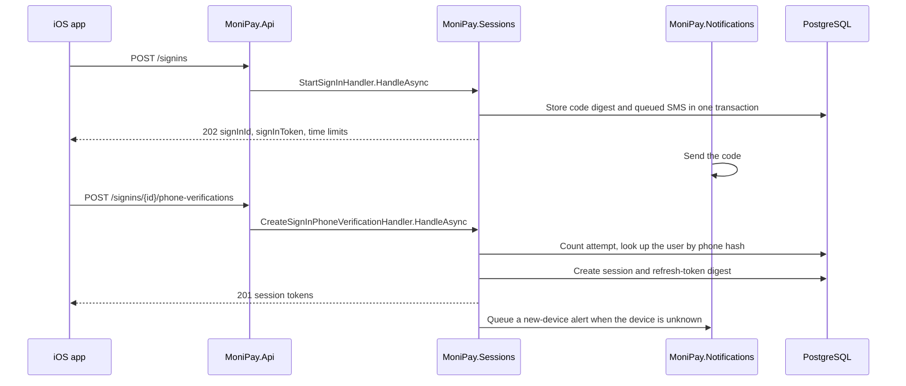

# Sign-in and device change

Status: Proposed, delivered after sign-up

## Purpose

Sign-up creates the user and the first session. This document covers the second session: a registered user on a new device, after a reinstall, or after a revoked session.

The prototype has a separate "sign in" entry on the welcome screen. The iOS app has none yet. Nothing in the repository defines sign-in, so this document does.

## Decision

Sign-in is phone verification followed by session creation. It reuses the sign-up verification mechanics and adds no password.

A sign-in is a separate resource, `signins`, in `MoniPay.Sessions`. It is not a sign-up in another state: it has no profile step, no legal consent, and no user creation.

The passcode is local, so a new device gets a new local passcode after sign-in. See [ADR 0002](../../adr/0002-passcode-and-biometrics-stay-on-the-device.md).

## Flow

Two requests, one SMS. There is no completion step.

## Routes

| Method | Route | Vertical slice | Authorization | Success |
|---|---|---|---|---|
| `POST` | `/signins` | `SignIns/Start` | Anonymous, rate limited | `202 Accepted` |
| `GET` | `/signins/{signInId:guid}` | `SignIns/Get` | Sign-in token | `200 OK` |
| `POST` | `/signins/{signInId:guid}/verification-code-deliveries` | `SignIns/ResendCode` | Sign-in token, rate limited | `202 Accepted` |
| `POST` | `/signins/{signInId:guid}/phone-verifications` | `SignIns/VerifyPhone` | Sign-in token, rate limited | `201 Created` |

`POST /signins` takes `phone` and `deviceId`. The response mirrors `POST /signups`: a `signins` resource with `status`, `codeDelivery`, `signInToken`, `codeExpiresAt`, `canResendAt`, and `signInExpiresAt`.

`POST /signins/{id}/phone-verifications` takes `verificationCode`. On success it returns the same `sessions` document as sign-up completion, with `Location: /sessions/current`.

The `SignIn` authentication scheme accepts the sign-in token only on `signins` routes and binds it to `signInId`, exactly as the `SignUp` scheme does.

## Registered and unregistered phones

`POST /signins` returns the same response and queues the same SMS for a registered and an unregistered phone. Revealing registration status before phone control is proven enables enumeration.

After a correct code:

| Phone | Result |
|---|---|
| Registered | `201` with a session |
| Unregistered | `409 phone-not-registered` |

The client then offers to create an account. That sign-up sends a second code. A one-code path that turns a sign-in into a sign-up would save one SMS at the cost of a route that returns two resource types; that trade is not taken.

The same rule already applies in the other direction: sign-up verification of a registered phone returns `409 phone-already-registered`, and the client offers to sign in.

## Device change

A session belongs to one `deviceId`. Signing in on a new device creates a new session and leaves the others active. A user can hold several sessions.

When the verified `deviceId` has no prior session for that user, the handler queues a `NewDeviceSignIn` SMS through the notification outbox. The message names the time and nothing else. It is required in the sense of [Notification architecture](notifications.md#message-catalog-for-sign-up-and-sessions): exhausted retries raise an alert.

A reinstall on the same device usually keeps the device-only Keychain items, so the refresh token survives and no sign-in is needed. When it does not, the app finds no refresh token, shows the welcome screen, and the user signs in. The `deviceId` is regenerated by the app when its Keychain item is missing, so the backend treats it as a new device and sends the alert.

Revoking the other sessions from the new device is a later feature. It needs a session list route and is listed under omissions.

## Limits

The sign-in limits reuse the sign-up values from [Security and operations](security-and-operations.md#proposed-defaults): six-digit code, five-minute code lifetime, one-minute resend cooldown, three resends, five attempts, fifteen-minute lifetime.

Per-phone starts share one budget across sign-up and sign-in: five per hour. Otherwise an attacker doubles the SMS cost per phone by alternating the two routes.

## Aggregate and persistence

`SignIn` is a second aggregate in `MoniPay.Sessions` with the code, attempt, resend, and expiry behavior of `SignUp` and none of its profile, consent, or completion state.

That shared behavior is promoted before sign-in ships: a `PhoneChallenge` owned type in `Domain/` carries `CodeDigest`, `CodeExpiresAt`, `FailedAttempts`, `ResendCount`, `CanResendAt`, `LockedUntil`, and the `RotateCode` and `Verify` methods. `SignUp` and `SignIn` both own one. The sign-up tables do not change; EF maps the owned type to the existing columns.

### `sign_ins`

| Column | Type | Rule |
|---|---|---|
| `id` | `uuid` | Primary key. |
| `phone_ciphertext` | `text` | Encrypted phone. |
| `phone_lookup_hash` | `bytea` | Keyed lookup hash. |
| `device_id` | `uuid` | The device asking to sign in. |
| `locale` | `varchar(16)` | From `Accept-Language`. |
| `code_digest`, `code_expires_at`, `failed_attempts`, `resend_count`, `can_resend_at`, `locked_until` | As `sign_ups` | The owned `PhoneChallenge`. |
| `signin_token_digest` | `bytea`, nullable | Workflow credential. |
| `status` | `varchar(24)` | `CodePending`, `Completed`, `Locked`, `Expired`. |
| `expires_at` | `timestamptz` | Sign-in lifetime. |
| `session_id` | `uuid`, nullable | Set at completion. |
| `version` | `bigint` | Concurrency token. |
| `created_at`, `completed_at` | `timestamptz` | Audit times. |

Indexes mirror `sign_ups`. The cleanup worker deletes expired sign-ins in the same batches.

## Problem types

| Problem type suffix | Status | Meaning |
|---|---:|---|
| `signin-token-invalid` | `401` | The Sign-in credential is invalid or expired. |
| `signin-expired` | `410` | The sign-in lifetime ended. |
| `signin-state-invalid` | `409` | The sign-in is not in a state that allows this action. |
| `phone-not-registered` | `409` | The verified phone has no user. Returned only after phone verification. |

`signup-attempt-limit`, `signup-resend-limit`, and `signup-resend-too-soon` are renamed to `verification-attempt-limit`, `verification-resend-limit`, and `verification-resend-too-soon` so one problem type serves both flows; `verification-code-invalid` and `verification-code-expired` already carry the neutral name. `signup-expired`, `signup-state-invalid`, and `signup-token-invalid` stay: they name the sign-up resource, not the challenge.

The rename is a breaking contract change for the deployed sign-up client, so it ships as its own server pull request, after the sign-in slices and before the iOS sign-in cutover, with a temporary `MoniPay:Sessions:LegacyVerificationProblemTypes` switch: on at deploy time so the deployed app keeps working, off once the iOS cutover reaches the store, then removed.

## Ports

The sign-in verify handler resolves the user through `IRegisteredPhoneLookup.FindUserIdAsync(phone)` from the sign-up design; it returns the `UserId` a registered phone belongs to, or `null` for `phone-not-registered`. The `NewDeviceSignIn` alert goes through `ISecurityAlertSender`, the port the refresh-replay and revocation alerts already use.

## Tests

The sign-in slices follow [Testing strategy](testing-strategy.md) with the sign-up cases plus:

- Starting a sign-in for an unregistered phone looks the same as for a registered one and records one SMS.
- Verifying an unregistered phone returns `phone-not-registered` and creates no session.
- Verifying on an unknown device creates a session and queues one `NewDeviceSignIn` message.
- Verifying on a known device queues no alert.
- Sign-up and sign-in starts for one phone share the hourly budget.
- A session created by sign-in refreshes and revokes like a bootstrap session.

## Delivery

Sign-in is a change after the sign-up plan in [Delivery plan](delivery-plan.md), in four pull requests, strictly in this order: the `PhoneChallenge` promotion, the `SignIn` aggregate and slices, the `verification-*` rename, and the iOS welcome-screen entry.

The iOS entry runs phone, code, then the local passcode and Face ID steps: a new device has no passcode yet ([ADR 0002](../../adr/0002-passcode-and-biometrics-stay-on-the-device.md)). It reuses the sign-up step views.

## Deliberate omissions

- Listing and revoking other sessions
- Trusted-device memory that skips the code
- Email or password sign-in
- Account recovery for a lost phone number, which is a KYC-backed process

## References

- [Domain and state](domain-and-state.md)
- [HTTP contract](http-contract.md)
- [Security and operations](security-and-operations.md)
- [ADR 0002](../../adr/0002-passcode-and-biometrics-stay-on-the-device.md)
