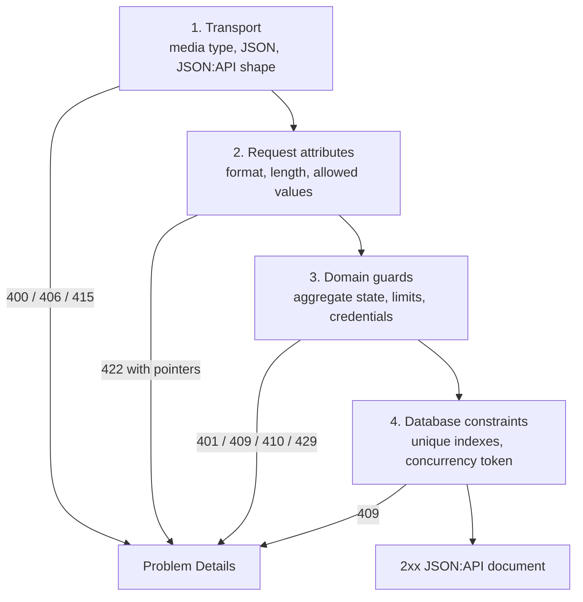

# Validation, guards, and error handling

Status: Proposed

## Purpose

This document defines where each sign-up rule is checked, what happens when a check fails, and how a failure becomes an RFC 9457 response.

It complements [API representation standards](api-standards.md), which defines the Problem Details shape, and [Domain and state](domain-and-state.md), which defines the state machine.

## Four validation layers

A request crosses four layers. Each layer rejects what the next layer must not see.



| Layer | Owner | Failure type | Status |
|---|---|---|---:|
| Transport | `MoniPay.Api` pipeline and Kernel JSON:API records | `malformed-json`, `jsonapi-document-invalid`, `not-acceptable`, `unsupported-media-type` | `400`, `406`, `415` |
| Request attributes | The slice request record | `validation` with one pointer per failure | `422` |
| Domain guards | The aggregate and the slice handler | One stable problem type per rule | `401`, `409`, `410`, `429` |
| Database constraints | EF configuration and PostgreSQL | `phone-already-registered`, `email-already-registered`, `concurrent-modification` | `409` |

A rule is checked once, at the lowest layer that has the data. A domain rule is never duplicated in a request record. A format rule is never duplicated in an aggregate.

## Layer 1: transport

The host owns transport validation. No slice repeats it.

| Check | Implementation | Result |
|---|---|---|
| `Content-Type` is `application/vnd.api+json` for a request with a body | Endpoint filter on every JSON:API group | `415` |
| Media-type parameters other than `ext` and `profile` | Same filter | `415` |
| `Accept` includes a supported response type | Same filter | `406` |
| Body parses as JSON | `System.Text.Json` through minimal-API binding | `400 malformed-json` |
| Document has `data`, `data.type`, and `data.attributes` | `JsonApiRequest<TData>` binding | `400 jsonapi-document-invalid` |
| `data.type` equals the slice resource type | Same binding | `400 jsonapi-document-invalid` |
| Unknown attribute member | `JsonUnmappedMemberHandling.Disallow` on request records | `400 jsonapi-document-invalid` |
| Body over 8 KiB | Kestrel request-size limit on the sign-up and session groups | `413` |

Unknown attributes are rejected, not ignored. A misspelled `verificationCode` must not silently pass as an empty value.

The transport check lives in `MoniPay.Api/Http/JsonApiTransportMiddleware.cs`. Modules mark a group through a Kernel-declared convention name, `MoniPayConventions.JsonApi`, so no module references the host.

It runs after routing and authentication and before minimal-API binding reads the body, so a rejected request never reaches the endpoint. The documented order is: routing, the no-store convention, the IP rate limiter, authentication and authorization, the JSON:API transport check, binding, the endpoint. The limiter and authentication still short-circuit first, which preserves the security behavior from #92.

The check reads the body once, bounded to 8 KiB, so the limit holds for a known and an unknown content length alike. It parses the body to tell invalid JSON syntax (`400 malformed-json`) from a valid JSON body with the wrong JSON:API shape (`400 jsonapi-document-invalid`), and it never matches framework exception text.

A slice supplies the expected `data.type` as `JsonApiResourceType` endpoint metadata, because the generic envelope cannot know which resource a route owns. Unknown members are rejected by `JsonUnmappedMemberHandling.Disallow` on the slice's attribute record, because the envelope's annotation is not recursive. Binding failures throw (`RouteHandlerOptions.ThrowOnBadRequest`) and map to `400 jsonapi-document-invalid`.

`Accept` must allow a JSON:API success representation. A client that accepts only `application/problem+json` is refused with `406 not-acceptable` before the endpoint runs; the error body is still Problem Details, because the error format is not negotiated. An explicit `q=0` on the JSON:API type beats a wildcard. `ext` and `profile` are accepted as parameter names on the request `Content-Type` and ignored; no extension is implemented, and an `Accept` range that names one does not match.

## Layer 2: request attributes

Each slice owns one request record and one `Validate` method on it. The record is a `sealed record` with `init` properties; validation runs in the endpoint before the handler is called.

```csharp
internal sealed record CreateSignUpCompletionAttributes(
    string FirstName,
    string LastName,
    string Email,
    Guid DeviceId)
{
    public ValidationFailures Validate()
    {
        var failures = new ValidationFailures();

        failures.Require(PersonName.IsValid(FirstName), Pointers.FirstName, ValidationCodes.PersonNameInvalid);
        failures.Require(PersonName.IsValid(LastName), Pointers.LastName, ValidationCodes.PersonNameInvalid);
        failures.Require(EmailAddress.TryNormalize(Email, out _), Pointers.Email, ValidationCodes.EmailInvalid);
        failures.Require(DeviceId != Guid.Empty, Pointers.DeviceId, ValidationCodes.DeviceIdRequired);

        return failures;
    }
}
```

`ValidationFailures`, `ValidationFailure(Pointer, Code)`, and `ValidationException` live in `MoniPay.Kernel/Validation/`. They contain no ASP.NET Core dependency.

The endpoint throws `ValidationException` when `failures.Any()`. The host exception handler turns it into one `422` document with one `errors` item per failure. The `detail` text comes from the owning module's `.resx` through the failure code.

No validation package is added. The rules are short, and a new dependency needs approval.

### Attribute rules

| Attribute | Rule | Failure code |
|---|---|---|
| `phone` | Digits only, 8 to 15 characters, no `+`, no spaces | `PhoneFormatInvalid` |
| `phone` | Country code in `SessionsOptions.SupportedCountries` and the local length for that country | `PhoneCountryUnsupported` |
| `termsVersion`, `privacyVersion` | Non-empty, at most 64 characters, equal to the currently published version | `LegalVersionOutdated` |
| `verificationCode` | Exactly `SessionsOptions.VerificationCodeLength` ASCII digits | `VerificationCodeFormatInvalid` |
| `firstName`, `lastName` | Trimmed, 1 to 64 characters, Unicode letters, marks, spaces, apostrophes, and hyphens | `PersonNameInvalid` |
| `email` | Trimmed, at most 254 characters, one `@`, a domain with a dot, ASCII local part | `EmailInvalid` |
| `deviceId` | A non-empty UUID | `DeviceIdRequired` |
| `refreshToken` | Base64url, 43 characters | `RefreshTokenFormatInvalid` |

The client already checks phone length and email shape. The server repeats every rule. The client check is a convenience; the server check is the contract.

`SupportedCountries` starts with the countries the iOS `Country` list ships today. Adding a country is a configuration change, not a code change.

An outdated legal version is a `422`, not a `409`. The client must show the new document and send the new version.

### Normalization

Normalization happens once, after validation, in a Kernel value type:

| Type | Normalization |
|---|---|
| `PhoneNumber` | Strip nothing; the input is already digits. Validate the country prefix and length. |
| `EmailAddress` | Trim, lowercase the domain part, keep the local part as entered. |
| `PersonName` | Trim, collapse internal whitespace to one space. |
| `Locale` | Resolve `Accept-Language` to one supported culture, defaulting to `fr`. |

Lookup hashes are computed from the normalized value only. Two spellings of one email must produce one hash.

## Layer 3: domain guards

A guard is a rule about state. It lives in the aggregate when it needs only aggregate data and in the handler when it needs a query, a clock comparison, or another aggregate.

### Aggregate guards

`SignUp` exposes one method per transition. Each method checks its guards in order and throws `RefusalException` with a stable code. The handler never inspects `Status` itself.

```csharp
public PhoneVerificationOutcome VerifyPhone(
    ReadOnlySpan<byte> candidateDigest,
    DateTimeOffset now,
    int maximumAttempts)
{
    if (Status == SignUpStatus.Expired || ExpiresAt <= now)
    {
        throw new RefusalException(MoniPayErrorTypes.SignUpExpired, StatusCodes.Gone);
    }

    if (Status == SignUpStatus.Locked)
    {
        throw new RefusalException(MoniPayErrorTypes.SignUpAttemptLimit, StatusCodes.TooManyRequests, retryAfter: LockedUntil - now);
    }

    if (Status != SignUpStatus.CodePending)
    {
        throw new RefusalException(MoniPayErrorTypes.SignUpStateInvalid, StatusCodes.Conflict);
    }

    if (CodeDigest is null || CodeExpiresAt <= now)
    {
        throw new RefusalException(MoniPayErrorTypes.VerificationCodeExpired, StatusCodes.Gone);
    }

    if (!CryptographicOperations.FixedTimeEquals(CodeDigest, candidateDigest))
    {
        FailedAttempts += 1;

        if (FailedAttempts >= maximumAttempts)
        {
            Status = SignUpStatus.Locked;
            return PhoneVerificationOutcome.Locked;
        }

        return PhoneVerificationOutcome.Mismatch;
    }

    Status = SignUpStatus.PhoneVerified;
    CodeDigest = null;
    VerifiedAt = now;
    return PhoneVerificationOutcome.Verified;
}
```

A wrong code returns an outcome instead of throwing. The handler must persist the attempt count before it answers, and an exception would skip that save.

`MoniPay.Kernel` has no ASP.NET Core reference, so `RefusalException` carries a `System.Net.HttpStatusCode`; the `StatusCodes` names above are shorthand for the same values. The lock sets `LockedUntil`, stored in `sign_ups.locked_until`, and `Retry-After` is derived from it.

One transition, one method, guard clauses first. A method that needs more than eight branches is split by state, not by adding a flag.

### Guard table

| Transition | Guard | Where | Problem type | Status |
|---|---|---|---|---:|
| Start | IP rate limit | ASP.NET Core rate limiter | `rate-limited` | `429` |
| Start | Phone starts per hour | Handler, `sign_ups` count by phone hash | `rate-limited` | `429` |
| Start | One active sign-up per phone | Handler, row locked `FOR UPDATE` under the phone lock, then unique partial index | Reuse the active sign-up, return `202` | `202` |
| Start | Reopened sign-up not locked | Aggregate | `signup-attempt-limit`, `Retry-After` to its expiry | `429` |
| Start | Reopened sign-up is `CodePending` | Aggregate | `signup-state-invalid` | `409` |
| Start | Reopened sign-up: cooldown elapsed, resend count below limit | Aggregate, the resend rules | `signup-resend-too-soon`, `signup-resend-limit` | `429` |
| Get | Workflow token matches `signUpId` | Authentication handler | `signup-token-invalid` | `401` |
| Resend | Sign-up not expired | Aggregate | `signup-expired` | `410` |
| Resend | Status is `CodePending` | Aggregate | `signup-state-invalid` | `409` |
| Resend | Cooldown elapsed | Aggregate | `signup-resend-too-soon` | `429` |
| Resend | Resend count below limit | Aggregate | `signup-resend-limit`, `Retry-After` to the sign-up's expiry | `429` |
| Verify | Sign-up not expired | Aggregate | `signup-expired` | `410` |
| Verify | Not locked | Aggregate | `signup-attempt-limit` | `429` |
| Verify | Code not expired | Aggregate | `verification-code-expired` | `410` |
| Verify | Digest matches | Aggregate, constant time | `verification-code-invalid` | `422` |
| Verify | Phone not already registered | Handler, `IRegisteredPhoneLookup` port on the normalized phone; the sign-up is closed so the phone is free at once | `phone-already-registered` | `409` |
| Complete | Registration token valid and bound to `signUpId` | Authentication handler | `registration-token-invalid` | `401` |
| Complete | Status is `PhoneVerified` or `Completed` | Aggregate | `signup-state-invalid` | `409` |
| Complete | Email not registered | Users handler, then unique index | `email-already-registered` | `409` |
| Complete | Phone not registered | Users handler, then unique index | `phone-already-registered` | `409` |
| Refresh | Token digest exists and is unused | `SessionTokenService` | `session-invalid` | `401` |
| Refresh | Token not consumed before | `SessionTokenService` | `refresh-token-reused` | `401` |
| Refresh | Session not revoked | `SessionTokenService` | `session-invalid` | `401` |
| Refresh | Device matches the session device | `SessionTokenService` | `session-invalid` | `401` |
| Any bearer route | JWT signature, issuer, audience, lifetime | JWT bearer handler | `session-invalid` | `401` |
| Any bearer route | `sid` names an active session | `AuthenticatedUser` policy | `session-invalid` | `401` |

`signup-state-invalid` and `rate-limited` are new problem types. Add them to the table in [HTTP contract](http-contract.md).

A `401` on a refresh or bearer route never says which check failed. The log carries the reason; the response carries one type.

### Handler guards and transactions

A handler guard that reads the database runs inside the same transaction as the write it protects. The pattern is:

1. Begin a transaction with `ReadCommitted` isolation.
2. Lock the aggregate row with `FOR UPDATE` through `ExecuteSqlAsync` or an EF interceptor on the slice query.
3. Call the aggregate transition.
4. Save changes.
5. Commit.

The concurrency token on `sign_ups.version` is the second line of defense. A lost update throws `DbUpdateConcurrencyException`, mapped to `409 concurrent-modification`. The client retries the read.

Concurrent verifications of one sign-up serialize on the row lock. Exactly one wins; the rest see the new state. The test in [Testing strategy](testing-strategy.md#concurrency-tests) proves it.

## Layer 4: database constraints

Constraints exist because handler checks race. Two completions with the same email can both pass a `SELECT`; only one passes the unique index.

| Constraint | Table | Mapped type |
|---|---|---|
| Unique `sign_up_id` | `users` | Idempotent: return the existing user, no error |
| Unique `phone_lookup_hash` | `users` | `phone-already-registered` |
| Unique `email_lookup_hash` | `users` | `email-already-registered` |
| Unique active `phone_lookup_hash` | `sign_ups`, partial on nonterminal status | Reuse the active sign-up |
| Unique `token_digest` | `refresh_tokens` | Internal error: a collision of 256 random bits is a generator bug |
| Unique `token_family_id`, `device_id` | `sessions` | `concurrent-modification` |
| Concurrency token `version` | `sign_ups`, `sessions` | `concurrent-modification` |

The Users registration handler catches `DbUpdateException`, reads the PostgreSQL constraint name from `PostgresException.ConstraintName`, and throws the matching `RefusalException`. Constraint names are constants in the EF configuration, so a renamed index breaks the mapping at compile time.

## Exception taxonomy

| Exception | Meaning | Thrown by | Mapped to |
|---|---|---|---:|
| `ValidationException` | Layer 2 failure with pointers | Endpoint | `422 validation` |
| `RefusalException` | An expected domain refusal with a stable code | Aggregate, handler, `SessionTokenService` | The code's status |
| `ProviderUnavailableException` | The verification code could not be queued inside the request | `VerificationCodeDeliveryAdapter` on an enqueue failure | `503` with `Retry-After` |
| `DbUpdateConcurrencyException` | Lost update on a concurrency token | EF Core | `409 concurrent-modification` |
| `DbUpdateException` with a known constraint | Uniqueness violation | EF Core, mapped in the handler | `409` with the constraint's code |
| `OperationCanceledException` while the request is aborted | The client left | Anywhere | No response is written |
| `ArgumentException`, `InvalidOperationException` | A programming error | Guards on public methods | `500 internal` |
| Any other exception | Unknown failure | Anywhere | `500 internal` |

`RefusalException` carries a `ProblemType` (the stable code bound to its HTTP status, declared once in `MoniPayErrorTypes`), an optional `RetryAfter`, and optional pointers. It carries no message for the user. The message is resolved from the code in the host.

`ProviderUnavailableException` carries the provider name and the provider's result code, so the host can log them.

`RefusalException` is the only exception a test asserts by type. Everything else is asserted through the HTTP response.

## Host error handling

`MoniPay.Api/Errors/MoniPayExceptionHandler.cs` implements `IExceptionHandler`. It is the single place that turns an exception into a response.

```csharp
internal sealed class MoniPayExceptionHandler(
    MoniPayProblemDetailsWriter writer,
    ILogger<MoniPayExceptionHandler> logger) : IExceptionHandler
{
    public async ValueTask<bool> TryHandleAsync(
        HttpContext context,
        Exception exception,
        CancellationToken cancellationToken)
    {
        var problem = exception switch
        {
            ValidationException validation => Problem.Validation(validation.Failures),
            RefusalException refusal => Problem.Refusal(refusal),
            ProviderUnavailableException => Problem.ServiceUnavailable(),
            DbUpdateConcurrencyException => Problem.Conflict(MoniPayErrorTypes.ConcurrentModification),
            OperationCanceledException when context.RequestAborted.IsCancellationRequested => null,
            _ => Problem.Internal(),
        };

        if (problem is null)
        {
            return true;
        }

        LogOutcome(problem, exception);
        await writer.WriteAsync(context, problem, cancellationToken);
        return true;
    }
}
```

`MoniPayProblemDetailsWriter`:

- Sets `Content-Type: application/problem+json`, without a charset.
- Sets `type` to `urn:monipay:error:` plus the code, or a stable framework fallback when the
  framework produced the status without a MoniPay code.
- Resolves `title` and `detail` through the localizer of the module that owns the code, using the
  request culture. An unknown code falls back to the code as its title and never throws.
- Preserves a caller's explicit type, title and status, so the Wallet refusal keeps its
  localized title.
- Sets `instance` to the request path and `traceId` from `Activity.Current` or
  `HttpContext.TraceIdentifier`.
- Preserves `WWW-Authenticate`, `Allow`, `Pragma` and an existing `Retry-After`. It does not
  replace a response whose body has started, and it skips the body for `HEAD`.
- Adds `Retry-After` for a refusal that carries a delay. `no-store` stays the no-store
  convention's job: `NoStoreMiddleware` already marks the credential routes before any
  short-circuit, so the writer preserves that header instead of duplicating it.

The writer never copies `exception.Message` into the body. A `500` body has `type`, `status`,
`title`, `instance`, and `traceId` only.

`MoniPayErrorTypes.ForStatus` maps a bare status to a stable type, so a client switches on `type`
and never on a localized reason phrase: `bad-request` (`400`), `unauthorized` (`401`),
`forbidden` (`403`), `not-found` (`404`), `method-not-allowed` (`405`), `content-too-large`
(`413`), plus the transport types above. A status with no fallback keeps RFC 9457's
`about:blank` type.

`ProviderUnavailableException` maps to `503 verification-delivery-unavailable`. It carries no
delay today, so the response omits `Retry-After` until a provider delay source exists. A `429`
still carries the delay the refusal or the limiter supplies.

`UseStatusCodePages` stays in the pipeline for responses the framework produces without an
exception, such as a `401` from the authentication handler. The writer is registered as an
`IProblemDetailsWriter` ahead of the framework default, and `MoniPayExceptionHandler` as the
single `IExceptionHandler`, so the status-code pages, an explicit `Results.Problem` and a thrown
exception all reach the same writer and every error body has one shape.

The Wallet refusal built with `Results.Problem` keeps its localized `title` and status and gains
`traceId`, `instance` and the stable fallback `type`. `WalletLocalizationTests` must pass
unchanged.

## Authentication failures

Authentication handlers do not throw. They return `AuthenticateResult.Fail` and let the challenge produce a `401` through the Problem Details writer.

| Scheme | Header | Bound to | Failure type |
|---|---|---|---|
| `SignUp` | `Authorization: SignUp <token>` | The `signUpId` route value | `signup-token-invalid` |
| `Registration` | `Authorization: Registration <token>` | The `signUpId` route value | `registration-token-invalid` |
| `Bearer` | `Authorization: Bearer <jwt>` | The `sid` claim and an active session row | `session-invalid` |

A token presented to the wrong scheme fails. The `SignUp` handler does not accept a registration token, and the bearer handler does not accept either workflow token.

A `403` is returned only when a valid principal lacks a policy. The sign-up design has no such route today.

## Rate limiting

Two layers, as [Security and operations](security-and-operations.md#rate-limits) states:

1. ASP.NET Core `RateLimiter` policies, partitioned by client IP after forwarded headers, on the anonymous groups. A rejection returns `429 rate-limited` with `Retry-After` through `OnRejected`, using the same writer.
2. Persistent per-phone limits in the handler, counted from `sign_ups` rows.

Both return the same problem type. The response does not say which layer fired.

## Guards on public methods

Every public method of a public type starts with argument guards:

```csharp
ArgumentNullException.ThrowIfNull(request);
ArgumentOutOfRangeException.ThrowIfNegativeOrZero(maximumAttempts);
```

These guard against programming errors, not user input. They produce a `500`, never a `422`. User input is validated in layer 2 before it reaches a public method.

`internal` handlers trust their callers. Guarding an internal method against `null` that the compiler already forbids is noise.

## Logging a failure

One structured log event per refusal, from a source-generated `[LoggerMessage]` method:

| Outcome | Level | Fields |
|---|---|---|
| Validation failure | `Information` | Route name, failure codes |
| Domain refusal | `Information` | Route name, problem code, `SignUpId` or `SessionId` |
| Rate limit | `Warning` | Route name, limiter name |
| Provider unavailable | `Warning` | Provider name, provider result code |
| Concurrency conflict | `Warning` | Route name, entity name |
| Unknown exception | `Error` | Exception, route name, `traceId` |

The forbidden-field list in [Security and operations](security-and-operations.md#logging) applies to every event. A log event never contains a phone, an email, a name, a code, or a token.

## Validation checklist for a new slice

- The request record has a `Validate` method and a test per rule.
- Every failure has a pointer to a real JSON member.
- Every domain refusal has a constant in `MoniPayErrorTypes`, a `.resx` entry in the owning module, and a row in [HTTP contract](http-contract.md).
- The aggregate, not the handler, checks state.
- Each uniqueness rule has a database constraint, and the handler maps its constraint name.
- The handler runs its guards and its writes in one transaction.
- The endpoint documents every status the slice can return in OpenAPI.
- A test covers the happy path, each refusal, and one concurrency case when the slice mutates state.

## References

- [RFC 9457, Problem Details for HTTP APIs](https://www.rfc-editor.org/rfc/rfc9457.html)
- [Handle errors in ASP.NET Core minimal APIs](https://learn.microsoft.com/aspnet/core/fundamentals/minimal-apis/handle-errors)
- [Rate limiting middleware in ASP.NET Core](https://learn.microsoft.com/aspnet/core/performance/rate-limit)
- [Handling concurrency conflicts in EF Core](https://learn.microsoft.com/ef/core/saving/concurrency)
- `agents/rules/quality-cyclomatic-complexity.md`
- `agents/rules/api-localization.md`
- `agents/rules/api-no-magic-strings.md`
